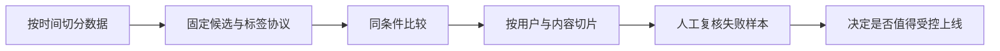

# 05 · 评估：先检查尺子，再庆祝涨分

**中文** · [English](05-evaluation-lab.en.md)

> 纯教学实验，所有 ID 和分数均为手写虚构数据，不对应任何公司或用户。

## 一个模型没变，分数却变了

假设唯一已知相关候选 P 得分 0.8。小候选池里另外 2 条分数都更低，P 排第 1；换一个更大的池子，新增 2 条分数更高的候选，P 掉到第 3。

模型没有改，但 Recall@2 从 1 变成 0。这里新增候选在教学标签中明确是不相关；真实日志里的未标注内容不能这样直接假定。

先别急着看公式。保持 Top-K=2，在下面切换“小候选池”和“新增高分负例”；再试“多个已知正例”，只改分母。你会看到两种完全不同的涨跌原因。

<div class="widget" data-recsys-evaluation><p>固定 K=2：小候选池中 P 排第 1，Recall=1；新增高分负例后 P 排第 3，Recall=0。若有 4 个正例而命中 2 个，标准 Recall 是 0.5，封顶分母的分数是 1。</p></div>

想复现第一组变化，只需要这几行：

```python
def recall_at_k(ranked, positives, cutoff):
    if not positives:
        return None
    hits = set(ranked[:cutoff]) & set(positives)
    return len(hits) / len(set(positives))

small_pool = ["P", "N1", "N2"]
larger_pool = ["N3", "N4", "P", "N1", "N2"]
print(recall_at_k(small_pool, {"P"}, 2))
print(recall_at_k(larger_pool, {"P"}, 2))
```

输出是 `1.0` 和 `0.0`。完整可运行例子在 [evaluation.py](code/evaluation.py)，只用 Python 标准库。

## 别把两个 Recall 定义混着用

这一页用标准的已知正例分母：

$$\operatorname{Recall@K}=\frac{|\operatorname{TopK}\cap P|}{|P|}.$$

如果改成除以 $\min(|P|,K)$，那是另一个归一化定义。比如 4 个已知正例、Top-2 命中 2 个，前者是 0.5，后者是 1；不写定义，读者根本不知道“涨了”意味着什么。

无已知正例的用户记为未定义，并单独报告数量，不要悄悄当成满分。正例很少时，指标波动大；比较人群还要看样本量、曝光机会和候选池，不能只比绝对分数。

## 冻结什么，才能比较什么

| 要比较的改动 | 至少固定什么 | 另看什么 |
| --- | --- | --- |
| 新召回来源 | 总候选预算、时间窗、标签协议 | 独有相关候选、覆盖与延迟 |
| 新 ranker | 同一批候选、特征快照、评估人群 | 排序效果、校准与成本 |
| 多样性重排 | 候选和基础分数 | 相关性损失、主题覆盖、重复率 |
| 新训练信号 | 独立评估集与清楚的标签口径 | 子群体表现、泄漏、负迁移 |

这些是控制变量建议，不是把真实系统拆得互不影响。固定条件的实验帮助归因，端到端实验再检查组合效果。

## 评估也要有数据流



历史行为不等于完整偏好。新系统会改变曝光，旧日志通常无法直接告诉你新曝光下的反应。模拟用户可以测试协议、极端情况和长期反馈环，却不是独立的真实用户收益证明。

## 自测

<details><summary>加大候选池后 Recall 下降，能说模型退步了吗？</summary><p>不能直接说。任务难度变了，先在同候选池、同标签协议下比较模型，再单独报告扩大覆盖的效果。</p></details>

<details><summary>多样性增加、原来的 Recall 不变，可以上线吗？</summary><p>还需看新增内容是否相关、哪些人群受益、是否影响安全与成本。离线证据用于决定下一步实验，不替代部署中的验证。</p></details>

系列读完后，回到[第 1 期](01-feed-pipeline.md)：你现在应该能说出每一层该用什么证据判断，而不是只问“模型分数涨了没有”。

接下来进入设计拆解：[为什么是双塔](06-why-two-towers.md) → [组件怎么选](07-component-choices.md) → [怎样可靠上线](08-serving-lifecycle.md)。
