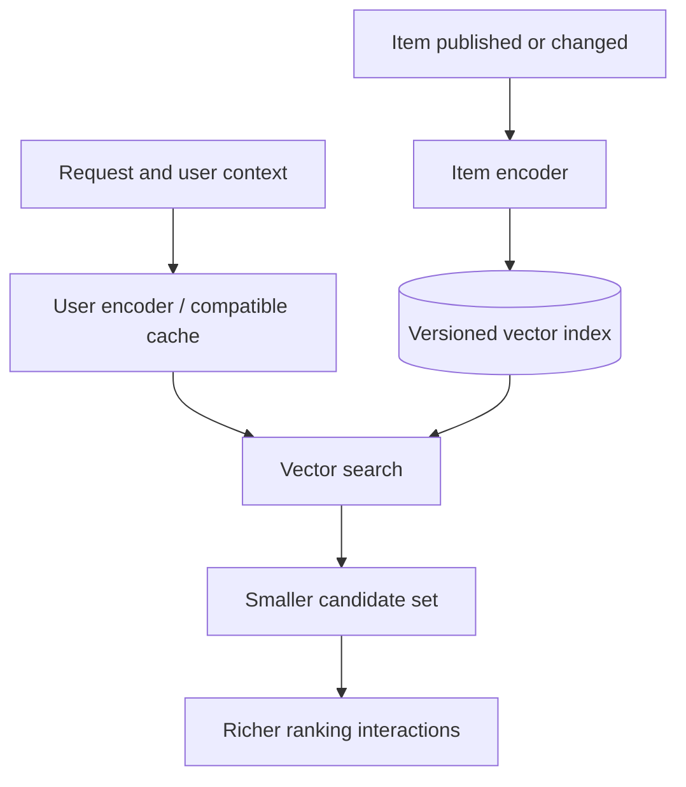

# 06 · Why two towers, rather than one bigger model?

[中文](06-why-two-towers.md) · **English**

> Last checked: 2026-09. Architecture explanations and invented examples, not an internal company implementation.

## Start with a million possible items

A model can jointly examine a user and an item with rich interactions. But doing that for a million pairs on every refresh immediately raises questions about computation and latency.

The starting question for a dual encoder is simple: **can work that doesn't depend on this request happen beforehand?**

Encode the user as $q=f_\theta(x_u)$ and the item as $v_i=g_\phi(x_i)$, then connect them with a cheap score:

$$s(u,i)=q^\top v_i.$$

The important property is separability, not merely having two models. The towers are typically trained together but can encode independently at inference. They may share parameters or use different architectures. The official TensorFlow Recommenders tutorial demonstrates this factorization. [Two-tower tutorial](https://www.tensorflow.org/recommenders/examples/basic_retrieval)

## What computation actually disappears?

An item vector can serve many requests. Online work often still includes user encoding, feature reads, and search. **Precomputed item vectors do not imply model-free online serving.** User vectors can also be cached, with freshness consequences.

A rough comparison:

| Path | Main per-request work | What it saves and gives up |
| --- | --- | --- |
| Joint encoding over the catalog | Run an interaction model for each user–item pair | Rich interactions, but cost grows with the candidate count |
| Dual encoder + exhaustive dot products | One user encoding and $N$ dot products of dimension $d$ | Reuses item encoding but still scans vectors |
| Dual encoder + ANN + ranking | User encoding, approximate search, then ranking a small set | Avoids some scanning but may miss exact neighbors |

An exhaustive dot-product scan costs $O(Nd)$ arithmetic, plus vector access. ANN cost depends on the algorithm, settings, and data; it cannot universally be called $O(\log N)$. Measure its quality–latency trade-off separately. [Efficient retrieval and approximation](https://www.tensorflow.org/recommenders/examples/efficient_serving)

A storage calculation: vectors aren't free

An invented setting: 1 million items, 256 dimensions each, and 4 bytes per FP32 value.

$$M=Ndb=10^6\times256\times4=1{,}024{,}000{,}000\ \text{bytes}.$$

That's about 1.024 GB or 0.954 GiB for vectors alone. It excludes IDs, index structures, replicas, caches, and overlapping old/new deployments.

Lower precision, compression, and fewer dimensions can save space in different ways. Model parameter count is not the memory footprint of the retrieval pipeline.

## Why not put every feature in the item tower?

Precomputing $v_i$ requires it to be independent of information that only arrives with a future request.

- **Fits the item side:** text, author or category features, and information that can be recomputed when the item changes.
- **Fits the user side:** profile, recent behavior, and available session context.
- **Needs another treatment:** whether this user just saw this item, their particular relationship with its author, and finer pairwise interactions. Some can be encoded in the towers; others belong in filters or ranking. Not every interaction fits losslessly into a dot product.

Making the item vector depend directly on each user sacrifices much of its cross-user reuse. That's possible, but it changes the cost model.

Items also change. How long an old vector may remain eligible after an edit is a product and engineering constraint, not something the encoder resolves.

## Can one vector blend distinct interests?

Yes. A person might read both programming and photography. A single vector is convenient, but may not preserve useful neighborhoods for both.

Multi-vector or multi-source retrieval offers options. These two designs are different:

1. **Mix vectors, then search once:** for example, $q=\alpha q_1+(1-\alpha)q_2$. Cost is easier to bound, but the interests may still be averaged together.
2. **Search separately, then merge:** each vector retrieves its own neighborhood before deduplication and budget allocation. This retains distinct candidate sources at greater search and coordination cost.

The second is not a free upgrade. Fix the total candidate budget and measure **unique relevant candidates**, not simply how much more content extra searches return. Start with [the complementarity example in episode 2](02-candidate-retrieval.en.md).

### Try it: mix first, or search separately?

The two interests point in different directions. Keep K=4 and weight=0.5, switch query modes, and compare the returned IDs. Then set K=8 and interest 1’s weight to 1 to see duplicates in split search.

A single query mixes the intent vectors before searching once. Split search retrieves neighbors independently under a fixed total slot budget. The sets can differ; split search costs more and may leave fewer unique items after deduplication.

This shows geometry and budgeting, **not which candidates are more relevant**. The two queries are also not the two towers: both are on the user side. The item tower still produces the catalog’s candidate vectors.

## How do both towers learn a compatible notion of closeness?

Architecture provides the container; the objective decides what should be close. One teaching example is a contrastive objective that places a known positive above sampled alternatives.

$$\mathcal L_u=-\log\frac{\exp(s(u,i^+)/\tau)}
{\exp(s(u,i^+)/\tau)+\sum_{j\in\mathcal N_u}\exp(s(u,j)/\tau)}.$$

$\mathcal N_u$ is the sampled comparison set, **not automatically a set of explicit user rejections**. Other batch members' positives are convenient negatives but may be false negatives. Duplicate items, multiple positives, and the sampling distribution change the optimization problem. Multiple positives require adjusting this single-positive formulation.

A stronger tower may not fix missing label distinctions, coverage, or unsuitable negatives. Also distinguish contrastive retrieval training from generative next-token SFT: they don't have the same loss.

## When should you not rush into two towers?

- The candidate set is already small: try direct scoring before taking on index maintenance.
- Exact terms matter: keyword or rule-based retrieval can be necessary complements.
- Fine-grained matching matters: retrieve first, then jointly encode a small set. This division also appears in text retrieval. [Retrieve & Re-Rank](https://www.sbert.net/examples/sentence_transformer/applications/retrieve_rerank/README.html)
- Evidence for a complex model is weak: establish a measurable baseline and locate the bottleneck.

**Two towers are a trade-off between expressiveness, reusable computation, and search cost—not a mandatory stage of building recommendations.**

## Self-check

Both models output 256 dimensions. Can a new user tower use the old index?

Not necessarily. Equal dimensions don't imply a shared coordinate system. Check training compatibility, normalization, distance, and release versions.

Encode the user once, then score every item by dot product. Is that ANN?

No. That remains exhaustive exact search. Two towers describe model factorization; ANN describes the search implementation.

Next: [What could each component be?](07-component-choices.en.md)
