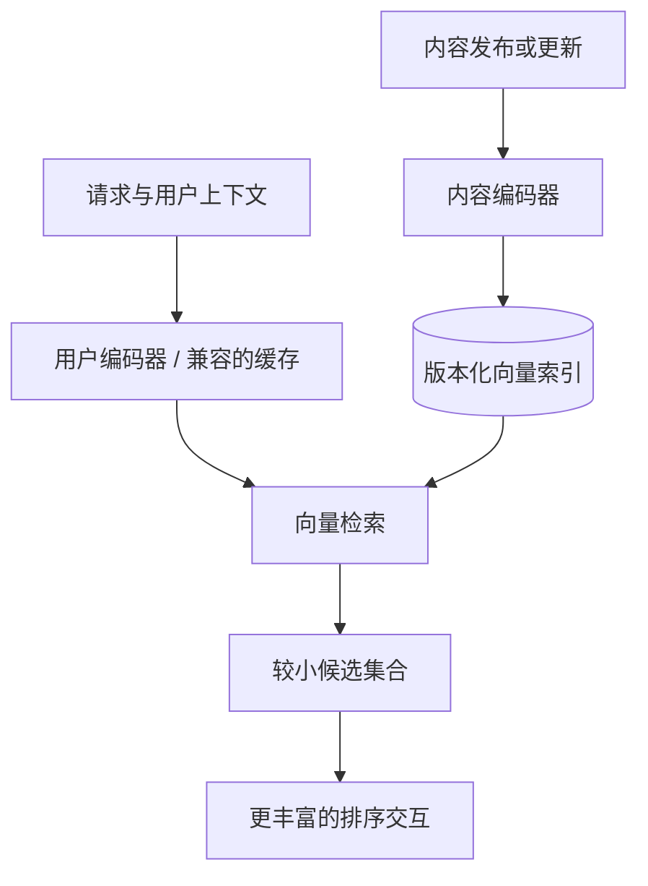

# 06 · 为什么用双塔：提前计算与表达能力的取舍

**中文** · [English](06-why-two-towers.en.md)

> 最近核验：2026-09。架构解释与虚构算例，不对应任何公司的内部实现。

## 先想象你要从 100 万条内容里挑候选

让模型同时看“这个人 + 这条内容”，当然可以设计出很丰富的交互。但如果每次刷新，都要对 100 万个组合跑一次这样的模型，你首先碰到的是计算和延迟预算。

双塔的出发点很朴素：**能不能把与这次请求无关的工作先做掉？**

用户侧算 $q=f_\theta(x_u)$，内容侧算 $v_i=g_\phi(x_i)$，最后用一个便宜的打分函数连接：

$$s(u,i)=q^\top v_i.$$

关键不是“有两个模型”，而是分数可以拆开算。两侧通常一起训练，但推理时能分别编码；可以共享参数，也可以使用不同结构。TensorFlow Recommenders 的官方教程给出了这种分解的基础实现。[双塔教程](https://www.tensorflow.org/recommenders/examples/basic_retrieval)

## 它省掉的到底是哪部分？

一条内容的向量可以被很多请求复用。在线通常仍有用户侧编码、特征读取和检索；**预计算内容向量，不等于线上不跑模型。** 用户向量也能缓存，但缓存粒度和更新频率会影响新鲜度。

可以粗略比较两条路径：

| 方案 | 每请求主要工作 | 省下什么，放弃什么 |
| --- | --- | --- |
| 对全库做联合编码 | 对每个用户—内容组合执行交互模型 | 交互丰富，但候选越多越贵 |
| 双塔 + 全量点积 | 一次用户编码，加 $N$ 次 $d$ 维点积 | 内容编码可复用，但仍要扫描向量 |
| 双塔 + ANN + 排序 | 用户编码、近似检索、对少量候选排序 | 少扫描一些内容，但可能漏掉精确近邻 |

精确点积扫描的计算量是 $O(Nd)$，还要考虑读取向量的开销。ANN 的成本依赖算法、参数和数据，不能统一写成 $O(\log N)$。近似检索引入了自己的质量—延迟取舍，应该单独测量。[高效检索与近似误差](https://www.tensorflow.org/recommenders/examples/efficient_serving)

算一次存储：向量并不是免费的

纯教学设定：100 万条内容，每条 256 维，每维 FP32 的 4 bytes。

$$M=Ndb=10^6\times256\times4=1{,}024{,}000{,}000\ \text{bytes}.$$

大约是 1.024 GB，或 0.954 GiB。这里只算向量，不含 ID、索引结构、副本、缓存，也不含新旧版本并存时的空间。

降精度、压缩、缩小维度都可能省空间，但影响不一样。别用“模型只有多少参数”代替对整条检索链的内存估算。

## 为什么不能把所有特征都塞进内容塔？

想提前算好 $v_i$，就要求它不依赖这次请求里尚未出现的信息。

- **适合内容侧**：内容文本、作者或类别特征，以及能在内容更新时重新计算的信息。
- **适合用户侧**：用户画像、近期行为、这次会话里已经知道的上下文。
- **需要另想办法**：这位用户是否刚看过这条内容、具体用户与作者的关系、两者之间更细的交互。可以部分编码到两侧，也可以交给过滤和排序；并非所有交互都能无损塞进一个点积。

如果让内容向量直接依赖每位用户，就失去了“同一向量服务很多用户”的主要复用机会。不是不能这么做，而是你已经改变了原来的成本模型。

另外，内容会变化。作者编辑帖子后，旧向量还能不能继续服务多久，是产品和工程一起定义的约束，不是 encoder 自己能解决的问题。

## 一条向量会不会把兴趣混在一起？

可能。比如一个人既看编程，也看摄影。压成一个向量很方便，但它未必同时保留两个方向最有用的邻域。

可以考虑多向量或多路召回。不过下面两种设计不是一回事：

1. **先混合向量，再查一次**：例如 $q=\alpha q_1+(1-\alpha)q_2$。仍是一条查询向量，检索成本较易控制；两个兴趣也仍可能被平均。
2. **分别查询，再合并候选**：每条向量找自己的邻域，再去重和分配预算。能保留不同候选来源，但查询、合并和更新更贵。

第二种也不是免费升级。要固定总候选预算，检查额外一路带来的**独有相关候选**，而不是只证明多查几次找到更多内容。先读[第 2 期的互补性例子](02-candidate-retrieval.md)，再决定是否值得增加复杂度。

### 先动手：混在一起，还是分开查？

两种兴趣在图里是两个方向。先保持 K=4 和权重 0.5，切换查询方式，看找回的候选是不是同一批。再把 K 拉到 8、兴趣 1 权重拉到 1，观察分开查时的重复候选。

单查询先混合两条兴趣向量，再搜索一次。分开查询分别取邻居，按固定总槽位合并。两种方法可能得到不同集合；分开查需要更多计算，去重后也不保证填满。

这个图只说明几何和预算的变化，**没有证明哪种候选更相关**。图里的两条查询也不是“双塔中的两个塔”：它们都在用户侧；内容塔仍负责那一库候选向量。

## 两座塔靠什么学到同一种“相近”？

双塔把打分拆成两部分，但还没有规定什么内容应该得高分。训练时，一种常见做法是让已知正例比采样到的其他内容更靠前：

$$\mathcal L_u=-\log\frac{\exp(s(u,i^+)/\tau)}
{\exp(s(u,i^+)/\tau)+\sum_{j\in\mathcal N_u}\exp(s(u,j)/\tau)}.$$

这里 $u$ 是用户，$i^+$ 是一个已知正例，$s(u,i)$ 是匹配分数，$\tau>0$ 是温度。$\mathcal N_u$ 是训练时选出的对比集合，**不一定是用户明确拒绝过的内容**。

可以先看只有一个对比项的情况。正例与对比项分数相同，softmax 分给正例的概率是 1/2，loss 为 $-\ln(1/2)\approx0.693$；如果正例高出 $\tau\ln3$，这个概率就变成 3/4，loss 约为 0.288。训练在推动正例相对靠前，这个概率只针对当前对比集合，并不是用户点击该内容的真实概率。

用同 batch 里其他人的正例作对比项很方便，但其中可能也有当前用户喜欢的内容，这就是假负例（false negative）。重复物品、多正例和不同采样分布，都会改变训练目标。多个正例时，也要调整上面的单正例写法。

这就是为什么“换一个更强的塔”未必解决问题：你可能缺的是标签区分、覆盖或合适的负例，而不是参数。也别把检索的对比训练和生成式语言模型的 next-token SFT 当成同一个损失。

## 什么时候不急着用双塔？

- 候选本来很少：先试直接打分，别提前承担索引维护成本。
- 精确词项是关键：关键词或规则召回可能是必要的补充，而不是落后的替代品。
- 任务需要细粒度匹配：可以先召回，再让联合编码模型处理小集合。这个“先便宜地找，再仔细地比”的分工也用于文本检索。[Retrieve & Re-Rank](https://www.sbert.net/examples/sentence_transformer/applications/retrieve_rerank/README.html)
- 数据还不足以支持复杂模型：先建立可测的基线，确认瓶颈到底在哪。

双塔适合把大量计算提前完成，但会限制用户与内容的细粒度交互。是否值得这样拆，要看候选规模、延迟要求，以及后面的排序模型能补上多少信息。

## 多向量以后，线上还怎么保持便宜？

“用户有多个兴趣”并不自动意味着每次都应该发很多查询。假设保留 profile 与 history 两个向量，可以有三种不同实现：

| 做法 | 请求时发生什么 | 保住什么，又丢掉什么 |
| --- | --- | --- |
| 先加权融合成一个向量 | 一次 ANN 查询 | 接口简单，但少数兴趣仍可能被平均掉 |
| 两个向量各查一路，再合并 | 两次查询、去重、固定总预算 | 保留独立邻域，增加查询和合并成本 |
| 根据当前证据只选一个或分配配额 | 路由，再做有限查询 | 控制预算，但路由错误会直接丢候选 |

多塔训练与多查询 serving 不是一回事。你可以训练两个视角，最后仍只查一个向量；也可以不做复杂训练，先测两路候选是否互补。先用后者的小实验决定是否值得进一步投入，通常比先把 router 搭满更容易解释。

若预算为 100，公平基线不是单向量取 100 对比双向量各取 100。先固定合并后的总量，同时记录实际 ANN 查询次数和 overfetch；多查询即使最终仍为 100，也未必同成本。缓存用户向量能省编码，不能消除索引查询与新鲜度的代价。

## 自测

两个模型都输出 256 维，旧索引能接新用户塔吗？

不一定。同维度不代表同一个坐标系；还要验证训练配对、归一化、距离定义和版本兼容性。

用户先编码一次，随后对全库算点积，是 ANN 吗？

不是。那仍然是精确的全量扫描。双塔定义模型分解，ANN 定义检索实现，两者要分开判断。

下一篇：[每个组件还能怎么选？](07-component-choices.md)
