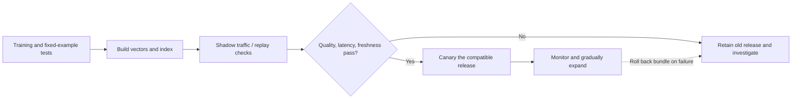

# 08 · After the diagram: making a request finish reliably

[中文](08-serving-lifecycle.md) · **English**

> Teaching design with fictional IDs, vectors, and releases. These are proposed engineering checks, not a company's internal system.

## Start with things that must not change silently

Suppose the model choice is settled: precompute items, encode users, retrieve from several sources, then rank. Before turning each box into a service, ask: **what could make the API succeed while the result is wrong?**

Examples include a new user tower querying an old index, deleted content returning from cache, a timeout counted as an unhelpful retrieval source, or training with features that arrived after the request. None necessarily raises an exception.

## 1 · Interfaces carry more than a list

A minimal teaching checklist—not an invitation to log raw personal data:

| Boundary | Agree on at least | Why keep it |
| --- | --- | --- |
| Request → retrieval | Request ID, deadline, permitted data scope | Components shouldn't guess timeouts or permissions |
| User encoder → index | Representation-space version, dimensions, metric, normalization | Equal dimensions may use different coordinates |
| Retrieval → merger | Item ID, provenance, source rank/score, completion status | Distinguish no match, incomplete work, and filtering |
| Merger → ranker | Deduplicated IDs, required features, missingness, total budget | Bound work and separate defaults from observed values |
| Response → feedback | Actual exposure/position, relevant releases, observation window | Returned isn't necessarily seen; inactivity isn't rejection |

Log only what diagnosis needs, with access controls, redaction, and retention limits. Observability does not justify unlimited personal-data collection.

## 2 · Catch a silent mistake with a tiny program

The [reference implementation](code/two_tower_reference.py) uses only Python's standard library. It performs exact search, not model training or ANN serving. Its small scope makes three checks visible:

- Query and index declare a compatible representation space, dimensionality, and metric.
- Excluded items cannot enter top-k.
- Scores and tie-breaking are deterministic enough for regression checks.

From the repository root:

```bash
python3 practice/recommender-systems/code/two_tower_reference.py
```

The default example returns A, B; excluding A returns B, C. Changing the query release produces an explicit rejection rather than plausible-looking scores.

A version label prevents accidental mismatches; it doesn't prove mathematical compatibility. Deployment also needs fixed-example train–serve parity, exact top-k, and approximation checks. Production deletion needs cache invalidation and final eligibility checks, not just this example's exclusion set.

## 3 · One slow source shouldn't stall everything

Choose “Dense source times out,” then “Query/index mismatch” below. Both return only A, for different reasons: one did not finish; the other was deliberately rejected. Identical final lists can hide very different system states.

<div class="widget" data-recsys-architecture><p>Graph returns A/B, Dense returns B/C/D, and B is deleted. Normal requests return C/D. A timeout or rejected index mismatch leaves A. Keep the usable source without bypassing deletion or calling a failure a successful empty result.</p></div>

Make these decisions explicit:

1. **The deadline is a shared budget.** Leave time for features, network calls, ranking, and serialization.
2. **Timeout isn't an empty set.** Successfully finding nothing and failing to receive a result require different diagnoses.
3. **Fallbacks have boundaries.** Return fewer results or use a simpler eligible source; don't skip permissions, safety, or deletions.
4. **Retries consume budget too.** Unbounded retries amplify overload; define attempts, remaining deadlines, and retryable errors.

Parallelism doesn't remove queues, stragglers, merging, or serial stages. Adding component p95 values doesn't give the request's p95; measure end to end.

## 4 · A model release is a compatible bundle

A rollback-ready retrieval release can include the user model, item model, preprocessing, normalization and metric definitions, index snapshot, feature schema, and a compatibility manifest.



A bundle means logical compatibility, not stopping every machine for a simultaneous switch. Pin a release ID per request so its components remain compatible. Choose the experiment unit carefully too; users crossing groups can complicate interpretation.

Rolling back only the user model may worsen a mismatch. Keeping two releases also consumes storage and build capacity; budget that before an incident.

## 5 · Freshness isn't just a vector timestamp

Edits, deletions, and new user feedback can all invalidate old representations.

- Use content versions to prevent stale out-of-order events overwriting newer ones; handle duplicates safely.
- Distinguish event time, processing time, and searchable time. Monitor backlog and end-to-end freshness lag.
- Inactive users and users with fresh actions need not share the same refresh policy.
- Historical replay must use features available at the time. Today's latest database state may leak future information.

Cache keys often need model and data versions. TTL is a backstop, not a complete update or deletion strategy.

## 6 · Test more than “returns 20 items”

| Test layer | A useful check |
| --- | --- |
| Unit | Dot product/cosine, zero vectors, release mismatch, deterministic order |
| Component integration | Missing features, deduplication, post-filter shortfalls, source timeouts |
| Data and model | Temporal splits, train–serve parity, exact-versus-ANN comparisons |
| Load and faults | Concurrency, hot keys, queues, cold caches, slow or partially unavailable dependencies |
| Release and recovery | Old/new isolation, cache/index consistency after rollback, deletions remain effective |

The tiny program covers only part of the first layer. Passing it doesn't mean production-ready. Define acceptance checks for each layer, then return to [episode 5](05-evaluation-lab.en.md) for task-level evidence.

## Can a late update resurrect a deleted item?

Follow a fictional event sequence: version 2 is published at 10:00, deleted at 10:01, and a retried “write v2 vector” arrives at 10:02. Blindly applying each arriving update can bring deleted content back.

One possible contract assigns comparable monotonic versions to all changes for an item, including deletion. Consumers reject older writes and retain a tombstone. If v3 deletes the item, delayed v2 cannot revive it. Tombstone retention must cover retry/replay windows and reconcile with authoritative state, not rely on vector-cache TTL alone.

That still doesn't establish that ANN deletion has completed. A final eligibility check must block the item. If that service is unavailable, a safety-sensitive path cannot interpret “check failed” as “allowed”; narrow to a safe fallback or fail explicitly.

Count retries across layers. If a request passes through three layers, each making **at most three attempts including the first call**, independently exhausting those budgets can cause `3×3×3=27` calls at the lowest layer. “Retry three times after failure” instead permits four attempts per layer, for a worst case of `4×4×4=64` calls.

Decide which layer owns retries, propagate the remaining request deadline, and cap total retry work. Google SRE's [overload chapter](https://sre.google/sre-book/handling-overload/) explains the amplification; the timestamp/version example here is an original teaching design.

## Self-check

<details><summary>All retrieval services returned HTTP 200. Is the system correct?</summary><p>Not necessarily. Check release compatibility, eligibility, feature timestamps, degraded sources, and whether score semantics still match training.</p></details>

<details><summary>Why need both exact-search comparisons and relevance evaluation?</summary><p>The first isolates index approximation; the second tests the model and task. An index can faithfully implement a poor model, while a good model can suffer from a faulty index deployment.</p></details>

Return to the [series introduction](README.en.md). On your next diagram, label each box with its inputs, outputs, alternatives, failure behavior, and verification plan.
