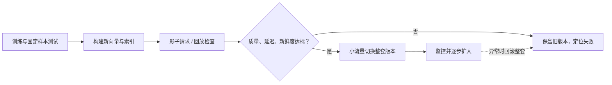

# 08 · 推荐服务：超时、内容更新与版本发布

**中文** · [English](08-serving-lifecycle.en.md)

> 教学设计：使用虚构 ID、向量和版本。这里提出的是可以验证的工程约束，不描述任何公司的内部系统。

## 先写下不能悄悄改变的几件事

假设模型已经选好：内容预编码，用户侧生成查询向量，多路召回后排序。接下来不是直接把框全变成服务，而是问：**哪些错误会让接口成功、结果却错了？**

例如：新用户塔接旧索引；删除的内容从缓存里回来；一路超时被统计成“召回没有价值”；训练用到了请求发生之后才产生的特征。这些不一定抛异常，却能让模型比较失去意义。

## 1 · 接口传的不只是一个 list

下面是一个最小的教学接口清单，不是要求把用户原始数据都写进日志。

| 边界 | 至少约定什么 | 为什么值得保留 |
| --- | --- | --- |
| 请求 → 召回 | request ID、截止时间、允许的数据范围 | 超时与权限不能靠各组件自己猜 |
| 用户编码 → 索引 | 表示空间版本、维度、距离与归一化规则 | 同维度也可能在不同坐标系 |
| 召回 → 合并 | item ID、来源、来源内顺序/分数、完成状态 | 区分没找到、没跑完、被过滤 |
| 合并 → 排序 | 去重后的 ID、所需特征、缺失标记、总预算 | 限制工作量，避免默认值伪装成真实值 |
| 返回 → 反馈 | 实际曝光与位置、相关版本、反馈时间窗 | 返回过不等于看见过，没操作不等于拒绝 |

日志只存诊断需要的字段，做访问控制、脱敏和保留期限管理；不为了“可观测”无限收集个人信息。

## 2 · 先检查版本和过滤有没有出错

[参考实现](code/two_tower_reference.py)只用 Python 标准库，做精确扫描，不训练模型，也不是 ANN 服务。它故意保持很小，让你能看见 3 个约束：

- 查询和索引必须声明兼容的表示空间、维度与打分方式。
- 被排除的内容不进入 top-k。
- 排序有明确的分数与相同分数时的顺序，方便回归测试。

在仓库根目录运行：

```bash
python3 practice/recommender-systems/code/two_tower_reference.py
```

默认示例先输出 A、B；排除 A 后变成 B、C。把查询版本改掉，程序明确拒绝，不默默返回“看起来正常”的分数。

版本标签只是防误接的检查，不会自动证明两个模型真的兼容。发布前还需要固定样本的 train–serve parity、精确 top-k 和索引近似误差检查。生产中的删除也需要缓存失效和最终资格复核，不能只依赖本例的一份排除集合。

## 3 · 慢一路，不该拖垮所有路

先在下面选“向量来源超时”，再选“查询与索引不兼容”。你会看到两次都只返回 A，但原因完全不同：一个没等到结果，一个主动拒绝错误组合。最终列表相同，不代表系统状态相同。

<div class="widget" data-recsys-architecture><p>Graph 返回 A/B，Dense 返回 B/C/D，B 已删除。正常返回 C/D；Dense 超时或被兼容性检查拒绝时，只剩 A。保留可用来源，不跳过删除规则，也不把错误记成成功的空结果。</p></div>

工程上需要明确：

1. **截止时间是共享预算。** 给特征、网络、排序和序列化留空间，不让每一路都吃掉整条请求的预算。
2. **超时是状态，不是空集合。** 正常完成但没有结果，与没拿到结果，后续诊断完全不同。
3. **降级有边界。** 可以少返回一些内容或使用合规的简单来源；不能跳过权限、安全或删除检查。
4. **重试也花预算。** 依赖已经过载时，无界重试只会加剧拥塞；明确次数、剩余时限和可重试错误。

多路可以并行，但排队、慢节点、合并和串行阶段仍会影响尾延迟。各组件 p95 相加也不等于整条请求的 p95，需要端到端测量。

## 4 · 发布一版模型，其实是在发布一组配套件

一个可回滚的 retrieval release 可以包含：用户模型、内容模型、预处理配置、归一化与打分定义、索引快照、特征 schema，以及声明它们兼容的 manifest。



这里“整套”指逻辑兼容，不要求所有机器同时停下来切换。可以给请求固定 release ID，让它一路使用匹配的部件。小流量阶段还要考虑实验单位，避免同一用户跨组造成解释困难。

只回滚用户模型、不回滚索引，可能比不回滚更糟。新旧版本同时保留也有存储和构建成本，要提前算，不等出问题再找旧文件。

## 5 · 新鲜度不是只看向量的生成时间

内容被编辑、删除，或者用户刚产生新反馈，都可能使旧表示不再适用。

- 用内容版本识别乱序事件，避免旧更新覆盖新更新；重复事件应能安全处理。
- 区分事件发生时间、处理时间和可检索时间，观察积压与端到端 freshness lag。
- 对不活跃用户的缓存和刚有新行为的用户，不一定使用同样的刷新策略。
- 回放历史请求时，只用当时可得的特征；“今天数据库里最新的一份”可能泄漏未来信息。

缓存 key 中通常要考虑模型版本和数据版本。TTL 是兜底，不是所有更新与删除问题的答案。

## 6 · 不要只测“能返回 20 条”

| 测试层次 | 一个值得做的检查 |
| --- | --- |
| 单元 | 点积 / cosine、零向量、版本不匹配、确定性排序 |
| 组件集成 | 特征缺失、ID 去重、过滤后不足、来源超时 |
| 数据与模型 | 按时间切分、训练—推理一致性、精确与 ANN 对照 |
| 负载与故障 | 高并发、热点、队列积压、冷缓存、慢依赖、部分不可用 |
| 发布与恢复 | 新旧版本隔离、回滚后缓存与索引一致、删除仍然生效 |

最小参考程序只覆盖第一层的一部分；通过它不等于生产就绪。每一层都要有自己的验收条件，再回到[第 5 期](05-evaluation-lab.md)检查业务相关的证据。

## 一次删除，怎么跑赢一条迟到的更新？

再跟一条虚构事件：10:00 内容升级到 v2，10:01 被删除，10:02 才收到重试的“写入 v2 向量”。若消费端见到更新就覆盖，删掉的内容会重新出现。

一个可行约定是：给同一内容的变更维护可比较的单调版本，删除也占一个版本；消费者拒绝比已处理版本更旧的写入，并保留删除标记（tombstone）。如果 v3 是删除，迟到的 v2 就不能复活内容。标记保留多久要覆盖重放/重试窗口，并与权威内容状态对账，不能只凭向量缓存 TTL 猜。

这还不代表 ANN 已同步删除。返回前的资格检查仍然需要挡住它。若资格服务不可用，安全敏感场景不能把“检查失败”当成“允许返回”；可以缩小候选范围、返回安全的降级结果，或明确失败。

多层重试也要一起算。假设一条请求依次经过 3 层，每层**最多尝试 3 次，包含首次调用**。如果每层都独立用尽次数，最底层最多收到 `3×3×3=27` 次调用。如果说的是“失败后再重试 3 次”，每层其实有 4 次机会，最底层上限就是 `4×4×4=64` 次。

因此要约定由哪一层负责重试，传递剩余的请求时限（deadline），并限制重试总量。Google SRE 的[过载处理章节](https://sre.google/sre-book/handling-overload/)解释了这种放大效应。这里的时间和版本例子是教学设计。

## 自测

<details><summary>召回服务都返回了 HTTP 200，能说明系统正确吗？</summary><p>不能。还要检查版本兼容、候选资格、特征时间、来源是否降级，以及最终排序的含义是否与训练一致。</p></details>

<details><summary>为什么上线前既要精确搜索对照，也要业务相关性评估？</summary><p>前者隔离索引近似误差，后者检查模型与任务。索引可以忠实执行一个不好的模型；模型也可以被错误的索引部署拖累。</p></details>

回到[系列导读](README.md)。再画一次架构图时，试着给每个框补上：输入、输出、替代方案、失败行为，以及你打算怎么验证。
