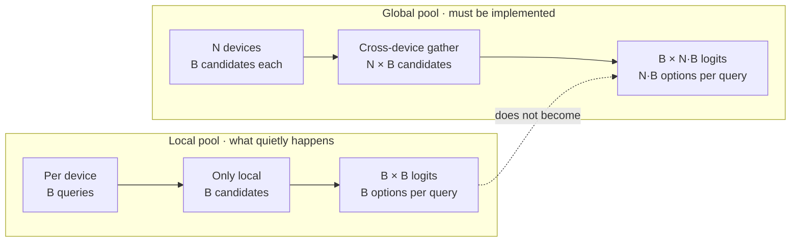
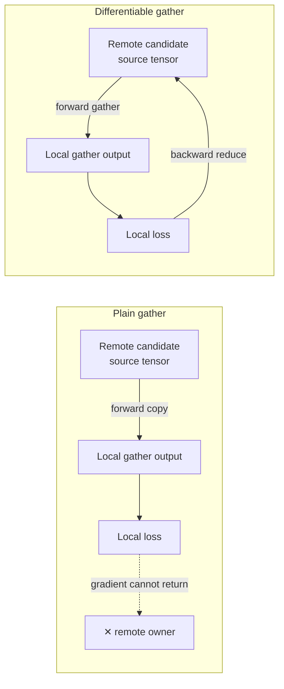
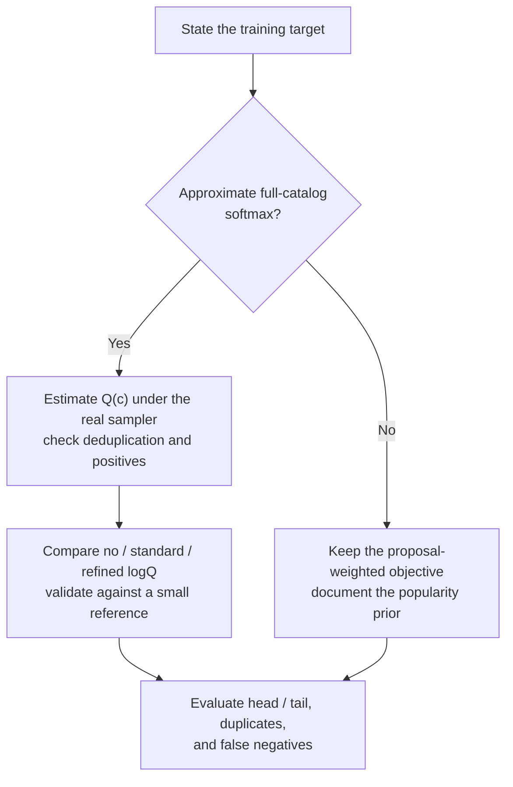

# How big is your negative pool, really

[中文](negative-pool-size.md) · **English**

> Reading time: ~8 min · Type: practice note · Last reviewed: 2026-08

## In one sentence

Contrastive learning is, at bottom, making the model take a multiple-choice test. In multi-GPU training it is easy to think you are setting a 1024-way question while every device is actually answering a 64-way one — **with no error raised anywhere**. The number and composition of the options jointly determine difficulty; a large pool is not automatically a good pool.

## Start with a multiple-choice question

Say I want to teach a model "what content suits this user."

I have one confirmed positive: user A genuinely liked item X. How do I train on that?

The most direct approach is to write a multiple-choice question. Show the model user A, then a pile of candidate items, one of which is X and the rest pulled at random. Ask it to pick X out. Reward a hit, penalize a miss.

That pile of random ones is the negatives. How many there are is how many options the question has.

Which raises the question that matters: **how many options does this question have?**

- 4-way: the model gets it right and you have learned almost nothing. Guessing scores 25%, and three of the four options are probably from a different planet than user A — all the model has to separate is "same universe or not."
- 1024-way: random sampling is more likely to include near misses, so the model usually needs a finer boundary. But if all 1023 negatives remain trivial, the large pool is only a more expensive freebie.

Retrieval faces the second situation for real: the candidate pool is wall-to-wall near-misses. So **too few options in training means drilling a model on freebies and then sending it to take the hard exam.**

That is what the negative pool controls. **Pool size determines how many candidates the model can compare; the sampling distribution determines which boundary it learns.** Both matter.

## Multiple devices do not imply global negatives

In multi-GPU training, the framework handles model state and gradient communication according to the parallel strategy. DDP replicates parameters and all-reduces gradients; FSDP or ZeRO is what shards parameters, gradients, or optimizer states.

But **you write the question yourself, inside the loss function.** The framework has no idea what your loss is doing, and it will not go collect other devices' candidates to serve as your distractors.

Say you have 16 devices with a per-device batch of 64, so in your head the negative pool is 16×64 = 1024. In reality each device only uses its own 64 samples as distractors. The question is still 64-way.



The important part is the dashed arrow: **how the model is parallelized and how many candidates appear in the loss denominator are separate decisions.**

| Thing | DDP | FSDP / ZeRO | Who decides |
| --- | --- | --- | --- |
| Parameters | Replicated per device | Sharded by strategy, gathered when needed | Parallel framework |
| Gradients | All-reduce | Reduce-scatter or equivalent | Parallel framework |
| Optimizer state | Usually replicated | May be sharded | Parallel framework |
| Data | Sampler gives each rank a different mini-batch | Same | Data loader |
| **Contrastive negative pool** | **May still be local** | **May still be local** | **Loss implementation** |

The first four rows are mostly controlled by the framework and data loader. The last usually is not. Distributed training can be bug-free while the model is still taking an exam that is far too easy.

**You have to confirm this by reading the loss function; the training config will not show it.** The config tells you the sharding strategy. It does not tell you how many terms are in the denominator.

## The denominator is where the information lives

Now put the question above on paper. This is InfoNCE:

$$\mathcal{L} = -\log \frac{\exp\big(s(u, c^+)/\tau\big)}{\sum_{c \,\in\, \{c^+\} \cup \mathcal{N}} \exp\big(s(u, c)/\tau\big)}$$

What each symbol is:

| Symbol | Meaning | What it is in code |
| --- | --- | --- |
| $u$ | One query — here, "user A's current state" | the user tower's output vector, `z_u` |
| $c^+$ | The right answer: the confirmed positive | the positive candidate's vector |
| $\mathcal{N}$ | The distractor set, i.e. the negative pool | every candidate in the denominator except the answer |
| $s(u,c)$ | The scoring function; in a dual encoder, a dot product | `z_u @ z_c` |
| $\tau$ | Temperature, controlling how "peaked" the softmax is | a scalar; smaller means only the closest few matter |
| The denominator | Every option's score, summed | **number of terms = number of options = $\lvert\mathcal{N}\rvert + 1$** |

Read aloud, the formula says: **the right answer's score, as a share of every option's score summed — push that share up.**

So nearly all of the learning signal lives in that denominator sum. The numerator is one term and proves nothing on its own; only being higher *than a pile of distractors* counts as having learned something.

With a paired local batch, there are usually $B$ options and $B-1$ presumed negatives. After a global gather there are $N\times B$ options and $N\times B-1$ potential negatives, before accounting for duplicate items, multiple positives, and false negatives.

When $N$ is in the dozens, that is more than an order of magnitude. The change needs no new annotation or architecture, but it increases communication, the logit matrix, and false-negative risk. It is worth checking early, but it is not a guaranteed free win.

## After gather, can the gradient get home?

The naive version:

```python
# incomplete for an exact global objective
parts = [torch.empty_like(z) for _ in range(world_size)]
torch.distributed.all_gather(parts, z)       # low-level collective has no autograd path
z_all  = torch.cat(parts)
logits = z_u @ z_all.T / temperature     # denominator now has N*B terms
loss   = cross_entropy(logits, labels)
```

The forward pass now looks right: the denominator really has $N\times B$ terms. The hard part is backward. Low-level `torch.distributed.all_gather` is a communication primitive and does not by itself define an autograd backward for its input. An exact global contrastive objective requires a differentiable collective or an equivalent custom backward reduction.

It moves the remote tensors, but the current rank's loss cannot follow plain gather back to those source tensors.

The picture is easier to remember than the API names:



There is also a common middle ground: gather detached remote representations and splice the local slice back into the graph. Local candidates receive gradients, but remote candidates still miss the current rank's contribution. That may be a useful approximation; it is not the exact global objective.

If the stated objective is every query against every candidate in the global batch, those cross-rank candidate-gradient terms are part of it. Plain gather omits them.

In exam terms, students see distractors written in other rooms, but revision requests never return to the original writers. The test got harder; the training objective only made it halfway home.

This does not imply that training is useless: the query tower still sees more candidates, and some approximate implementations accept the trade-off deliberately. The error is calling it the exact global loss.

There are three choices with different semantics:

1. Use an **autograd-aware** all-gather whose backward reduces contributions to each source rank.
2. Implement a custom `autograd.Function`: gather in forward, reduce-scatter or all-reduce in backward.
3. Gather detached tensors and splice the local slice back into the graph. This common approach restores local embedding gradients but **is not the exact global objective**; it is an approximation that must be named and validated as such.

This test is invalid:

```python
z_all = gather(z)  # assume this is the gathered output
g = torch.autograd.grad(loss, z_all, retain_graph=True)[0]
# loss can have a gradient with respect to z_all even if z_all is detached
# from the remote source tensors. This does not test the gather backward.
```

The correct test uses a tiny deterministic reference. Concatenate the same global batch in one process and compute the full loss and parameter gradients. Then run the distributed implementation from the same weights and examples. If it claims equivalence, the loss plus query- and candidate-tower gradients should match within tolerance.

## More options—but where were they sampled from?

This is the step hidden by the slogan that more negatives are always better.

Back to the test analogy. Where do the distractors come from? Borrowed from the other samples' candidates in the batch. And the batch is drawn at random from the data, so **an item's chance of appearing in a batch is proportional to how common it is.**

Popular items show up repeatedly as other queries' distractors. If the target is full-catalog softmax, this non-uniform proposal produces a biased gradient estimate because popular items are sampled as negatives more often.

A larger pool exposes each query to more draws from the same proposal distribution. The **absolute count** of popular items rises, but it is not generally correct to say the objective's bias is multiplied by exactly $N$. The relative proposal distribution is unchanged, while variance, duplicates, false negatives, and gradient weighting all change.

The standard fix is the logQ correction: subtract the log of the sampling probability from the score.

$$s'(u,c) = s(u,c) - \log Q(c)$$

| Symbol | Meaning | Where it comes from |
| --- | --- | --- |
| $s(u,c)$ | The raw score (the dot product) | the model computed it |
| $Q(c)$ | Probability or expected count of drawing $c$ under the negative proposal | must match the sampler, deduplication, and derivation |
| $-\log Q(c)$ | Larger when $Q(c)$ is smaller | gives low-probability candidates a larger importance correction |
| $s'(u,c)$ | The corrected score, and what goes into the softmax | replaces $s$ in the formula above |

Why subtract **$\log Q$**? When the target is full-catalog softmax, the negative sampler can be treated as an importance-sampling proposal. Subtracting $\log Q(c)$ removes the contribution from being frequently sampled under that proposal.

But logQ is **not mandatory for every contrastive objective**. If the intended objective is a conditional negative distribution, or the product deliberately preserves a popularity prior, the target is different. Standard logQ also treats the deterministic positive as though it were sampled from $Q$; recent work specifically refines that mismatch.

So do not start from “should I enable logQ?” Start from “which distribution am I trying to fit?”



A safer experiment matrix is `local/global pool × no/standard/refined correction`, with the sampler, deduplication rule, and evaluation index fixed. State whether the target is full softmax, a uniform catalog, or a product proposal before calling any correction correct.

## While you are here: do you need that sharding?

Since you are already in the distributed config, there is one more common mismatch.

**If model state fits comfortably on one device, sharding it across every device may trade cross-node bandwidth for memory savings you did not need.**

Budget the actual parameter dtype, gradients, master weights, and Adam states, then add activations, temporary buffers, and the $B\times NB$ logit matrix. A sub-1B model's **model state** may fit on a modern accelerator, while long context or a large negative pool can still make activations or logits dominate peak memory. Measure before choosing the sharding strategy.

Intra-node interconnect is an order of magnitude faster than inter-node fabric. A hybrid strategy — shard within a node, replicate across nodes — keeps every all-gather inside the node and lets only gradient sync cross it. Same memory budget, very different traffic.

And one that gets conflated constantly: **sharding parameters does nothing for activations.** Under long context the real memory consumer is the intermediate tensors saved in the forward pass, which is activation checkpointing's job and has nothing to do with how parameters are split. Maxing out sharding to fix an activation-driven OOM is reaching for the wrong knob.

Measure model state, activations, logits, and communication stalls separately, then compare DDP, FULL_SHARD, and HYBRID_SHARD on throughput and peak memory. Fitting on one device makes DDP a candidate; it does not prove DDP is fastest.

## Five questions to keep

1. Is my contrastive loss's negative pool local or global? — **read the loss function, not the training config**.
2. If it is global, do I want the exact global objective or an approximation? Do multi-rank parameter gradients match a single-process reference?
3. After enlarging the pool, do the proposal, duplicates, false negatives, and correction still correspond to the objective I intend to optimize?
4. The things I am sharding: do they actually fit on one device?
5. Is my memory going to parameters or activations? Am I turning the matching knob?

## Where to read next

- [What counts as a positive, and as a negative](positive-negative-design.en.md): where distractors come from, and what objective a correction should represent
- [Two towers, and why the user side splits into several](two-tower-and-beyond.en.md): the model shape this loss trains
- [From noisy feedback to a servable retrieval system](noise-to-signal-retrieval.en.md): the whole chain
- [PyTorch distributed collectives](https://docs.pytorch.org/docs/stable/distributed.html#torch.distributed.all_gather): call semantics for low-level `all_gather`
- [PyTorch FSDP sharding strategies](https://docs.pytorch.org/docs/stable/fsdp.html): communication semantics for DDP, FULL_SHARD, and HYBRID_SHARD
- [Sampling-Bias-Corrected Neural Modeling for Large Corpus Item Recommendations](https://storage.googleapis.com/gweb-research2023-media/pubtools/pdf/6417b9a68bd77033d65e431bdba855563066dc8c.pdf): the full-softmax and importance-sampling motivation for logQ
- [Correcting the LogQ Correction](https://arxiv.org/abs/2507.09331): why standard logQ is still imprecise for a deterministic positive
