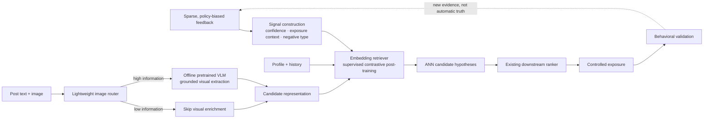
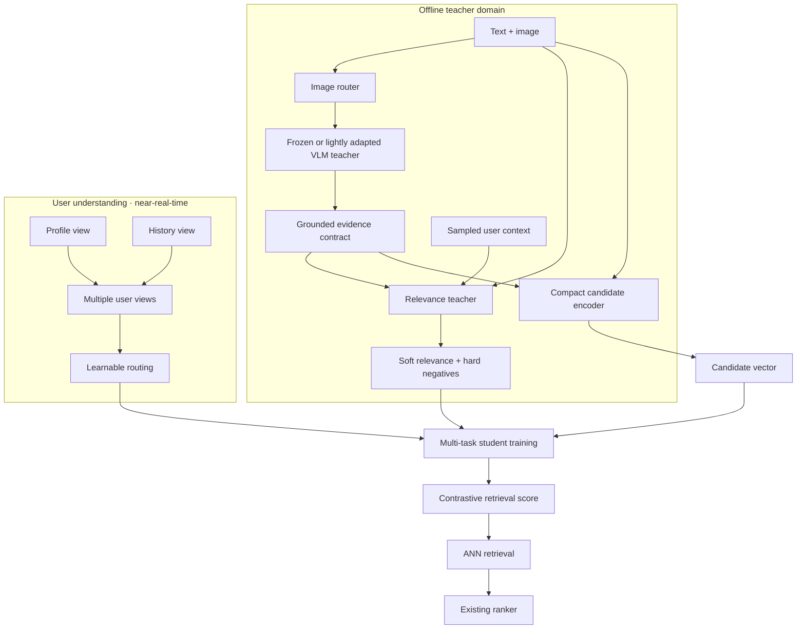
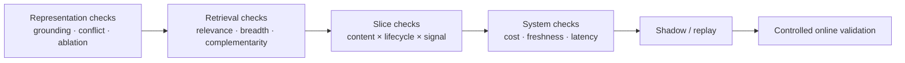

# From Noisy Feedback to a Serving-Efficient Retrieval System

[中文](noise-to-signal-retrieval.md) · **English**

> This is a public and intentionally abstracted design note. It discusses general problems and trade-offs rather than any company's data scale, schemas, model configuration, or production stack.

## In one sentence

The hard part of modern retrieval is often not attaching a larger model. It is:

> **learning a scalable proposal function from a tiny, policy-biased set of positive feedback, then searching a massive unobserved corpus for candidates likely to produce positive outcomes without treating model scores as new ground-truth labels.**

## Problem framing: from sparse positives to candidate hypotheses

For user $u$, let $\mathcal{C}$ be the retrievable corpus, $\mathcal{E}_u\subset\mathcal{C}$ the content actually exposed by the previous policy, and $\mathcal{P}_u\subset\mathcal{E}_u$ the much smaller subset with reliable positive feedback. This is not ordinary classification: most of $\mathcal{C}\setminus\mathcal{E}_u$ is **unlabeled, not negative**.

The retriever learns a scoring function $f_\theta(u,c)$ and proposes candidates from the unobserved space:

\[
\mathcal{H}_u
=\operatorname{TopK}_{c\in\mathcal{C}\setminus\mathcal{E}_u} f_\theta(u,c).
\]

$\mathcal{H}_u$ contains **positive hypotheses**, not new positives. Candidates become new evidence only after downstream ranking, real exposure, and behavioral validation. The system therefore separates four responsibilities:

1. **Signal construction:** decide which historical feedback is strong enough to supervise learning.
2. **Retriever:** propose high-potential candidates cheaply from a massive unobserved space.
3. **Ranker / policy:** use request context to decide which candidates receive exposure.
4. **Evaluation / experiment:** test whether those candidates create user value and write validated evidence into the next training snapshot.

The more precise framing is **candidate discovery from sparse, selectively observed feedback**. The retriever is a hypothesis generator; user behavior is the evidence generator.



## 0. Audit the system first: narrow signal, narrow ruler

Before changing the model, separate four recurring failure modes. These are generic patterns in large-scale behavioral retrieval, not fields or measurements from a particular system.

| Layer | Common symptom | Why it is fatal |
| --- | --- | --- |
| Training labels | Several nominal behaviors collapse onto one easy-to-collect proxy; explicit rejection is absent | The model reproduces the dominant proxy instead of learning broader relevance |
| User evidence | Histories contain only positive interactions; thin or truncated histories are underrepresented | The model does not learn aversion and understands least the users who most need durable intent |
| Negatives / loss | Many negatives are unexposed items or another user's positive; the actual competition pool may be smaller than the intended objective | “Unseen” becomes “disliked,” while training solves a much easier choice problem than catalog-scale retrieval |
| Offline evaluation | Positives are thin, Recall depends on pool construction, and train/eval share the same behavioral proxy | Segment scores are not directly comparable and richer signal may remain invisible to the old metric |

In one line: **the learning signal is narrow, and the measuring instrument is narrow too.** Signal, model, and evaluation must therefore be designed together.

## 1. Convert noise into signal

Clicks, dwell, and skips are not direct preference labels. Feedback exists only for content exposed by an earlier policy, while missing engagement may simply mean the item was never seen.

Training data should distinguish reliable positives, exposed negatives, semantic hard negatives, and unobserved candidates whose relevance remains unknown. This decision precedes the choice among SFT, preference optimization, and RL: a training algorithm can only amplify the supervision it receives.

## 2. Process images selectively

A text-only embedding misses information contained in screenshots, charts, posters, and natural images. Running a large VLM on every image, however, wastes compute.

A lightweight router first classifies the processing need:

```text
image
→ natural photo / screenshot / slide-like / chart / poster / decorative
→ allocate compute from type and confidence
```

For informative images, a pretrained VLM extracts visible text, important entities, the main visual meaning, evidence absent from the original text, image-text consistency, and confidence. The first version usually does not require VLM fine-tuning; LoRA or SFT becomes useful only after stable domain errors are shown to affect retrieval.

## 3. Post-training: what should the teacher produce?

The VLM is not the online retriever. It is a replaceable offline teacher with two distinct responsibilities:

1. **Content evidence:** extract grounded, confidence-aware facts when content is created or updated.
2. **Training supervision:** on sampled user–candidate pairs, combine user context with text and image evidence to produce soft relevance, pairwise preferences, and hard negatives that look similar but do not fit the current user.

The first responsibility improves candidate features. The second expands supervision beyond a dwell-like proxy. Feature extraction alone does not repair narrow labels.

Content evidence can follow a fixed schema:

```json
{
  "visual_type": "photo | screenshot | chart | poster | decorative",
  "visual_evidence": ["visible entities", "readable text", "visual claim"],
  "text_image_relation": "support | complement | conflict | irrelevant",
  "confidence": "calibrated score",
  "provenance": "which region supports each claim"
}
```

A lightweight candidate encoder combines the original text with this evidence and emits a vector that can be precomputed and written to the ANN index. Soft labels and hard negatives are consumed only during training. The teacher improves both content understanding and supervision density without entering every online request.

### Module composition



### Model selection: capacity follows the role

The goal is not to pick the model with the largest benchmark number. Each module should receive only the capacity required by its role:

| Module | Starting choice | Selection criteria | Why not use a larger model directly? |
| --- | --- | --- | --- |
| Image router | Small vision classifier or general visual encoder | Content type, information value, calibrated confidence | The router selects teacher calls; it does not need complete image understanding |
| Visual / relevance teacher | Small or medium open-source VLM with reliable schema adherence | Grounding, conflict detection, pairwise relevance, hard-negative precision, and calibration | The teacher runs selectively offline; larger models must earn their cost on the same held-out set |
| Candidate/user encoder | Compact open-source embedding model | Retrieval quality, throughput, long text, vector size, and refresh cost | First-stage retrieval requires frequent encoding and large-scale ANN, so capacity must obey serving budgets |
| Downstream ranker | Existing ranker | Request-level relevance, quality, and freshness | First-stage retrieval should not duplicate fine-ranking responsibility |

Generic benchmarks justify an initialization, not a domain decision. Embedding models should be selected on retrieval, breadth, complementarity, latency, index size, and freshness. Teachers should be selected on an independent held-out set measuring grounding, relevance calibration, and hard-negative precision.

A direct multimodal candidate encoder remains a valid experimental arm, but it couples visual understanding, embedding geometry, and index refresh to one checkpoint. The default **VLM teacher → grounded evidence / supervision → compact embedding student** is easier to audit, cache, degrade gracefully, and upgrade independently while keeping text-only content in the same ANN index.

### Parameter sharing

This is an **asymmetric dual encoder**: user and candidate representations occupy one vector space, but their input distributions and update rates differ.

```text
Candidate tower: post text + grounded visual evidence → z_c
User views:    instructed profile / history / latent intent → z_u,r
Similarity:      cosine(z_u,r, z_c), after identical pooling + L2 normalization
```

A practical starting point initializes every tower from the same general embedding checkpoint. Candidate and user sides use separate parameters or adapters; profile and history share the user backbone but use different instructions, adapters, or projection heads. This preserves a common semantic space while allowing view-specific compression.

Train-serving parity must fix the tokenizer, instruction templates, last-token pooling, L2 normalization, truncation rules, and visual-evidence schema. Otherwise the similarity optimized offline is not the similarity consumed by online ANN search.

The user side need not average all evidence into one point. Profile and history can remain separate views or expand into latent intent vectors. A router assigns context-dependent weights. Additional towers are useful only when they contribute complementary relevant candidates rather than duplicating one another.

Serving must not average those vectors before retrieval, which would recreate the original single-point representation. Instead, allocate a fixed total candidate budget $B$ across views:

\[
K_r = \operatorname{round}\!\left(B\cdot \operatorname{softmax}(g(u))_r\right),
\qquad
\mathcal{C}(u)=\bigcup_r \operatorname{ANN}(\mathbf{z}_{u,r},K_r).
\]

Each view queries the same candidate index. The system unions and deduplicates the results, then sends source view, similarity, and router weight to the downstream ranker. Multi-intent modeling therefore adds complementarity without creating an unbounded online candidate set.

### Three training layers

**Construct supervision.** Build confidence-aware batches from reliable positives, exposed negatives, semantic hard negatives, and unobserved candidates. Do not label "not seen" as "disliked."

**Multi-task post-training.** Keep InfoNCE as the retrieval objective; use KL or pairwise distillation for teacher relevance; preserve separate auxiliary heads for distinct actions; and place teacher-mined hard negatives into the contrastive pool. Sweep every weight and monitor whether task gradients conflict.

**Prevent module collapse.** Add targeted constraints and diagnostics:

- full and text-only inputs should agree when the image is redundant;
- masking the image should produce an explainable score change when visual evidence is essential;
- conflicting text and images should reduce confidence or preserve an explicit conflict state instead of being silently fused;
- routing entropy, view usage, and unique-target contribution should reveal whether every example has collapsed onto one tower.

An abstract objective is:

\[
\mathcal{L}
=\mathcal{L}_{\text{InfoNCE}}
+\lambda_d\mathcal{L}_{\text{distill}}
+\sum_a\lambda_a\mathcal{L}_{\text{action},a}
+\lambda_{r}\mathcal{L}_{\text{routing}}
+\lambda_{m}\mathcal{L}_{\text{modality}}
+\lambda_{c}\mathcal{L}_{\text{calibration}}.
\]

The core remains **supervised contrastive fine-tuning**, not generative GRPO for a fixed candidate-retrieval task. RL addresses a different problem when the objective becomes sequential, such as long-horizon slate reward or exploration policy.

### Start with the cheap version: a go/no-go gate

Before investing in a teacher, distillation, and routing, run two inexpensive changes on a fixed independent evaluation set: add trustworthy skip or rejection semantics to negatives, and split distinct actions out of one OR label. If richer supervision still produces no stable, interpretable movement, an expensive teacher should not be assumed to solve the problem.

This ordering forces evaluation to improve first and turns architectural complexity into a falsifiable decision rather than a preference.

### One complete training and release run

1. **Freeze event time:** build user, content, and exposure snapshots without future information.
2. **Generate visual evidence:** let the router select teacher calls and write outputs to a versioned evidence table.
3. **Compile examples:** bind behavior labels, negative type, user views, original text, and visual evidence to one manifest.
4. **Train the retriever:** keep the teacher frozen while updating user encoders, the candidate encoder, and routing; log each loss and view utilization separately.
5. **Export and replay:** batch-compute candidate vectors, build an isolated ANN index, and run the ablation matrix with a fixed downstream ranker.
6. **Release progressively:** pass representation, retrieval, slice, and systems gates before shadow traffic and controlled online validation.

Image-processing failures must fall back to the original text representation. Missing user views must cause the router to renormalize over the remaining views. **Fallback is part of the training-serving contract, not a patch added after launch.**

The retriever expands the high-quality candidate space. The existing downstream ranker remains responsible for request-level relevance, quality, freshness, and final ordering.

## 4. Keep expensive computation offline

```text
Offline:  image routing → selective VLM → candidate embedding → ANN index
Near-real-time: profile/history update → cached user representation
Online:   cache lookup → ANN retrieval → existing ranker → final slate
```

Multimodal understanding then improves candidate information without placing generation on every request. Failures should fall back to visible text and finally to the original text embedding rather than blocking index freshness.

## 5. Evaluation: prove that each module matters

> This section specifies an experimental protocol and release gates. It reports no observed results.

An aggregate score can hide subgroup regressions and can misrepresent "more relevant but semantically narrower" as an unconditional improvement. Evaluation should answer five separate questions.

### 5.0 Change the signal and the ruler together

If a student learns teacher-generated relevance and the same teacher later evaluates the student, the experiment becomes self-confirming. Preserve at least three independent anchors:

- sparse but semantically clear explicit actions;
- time and user slices that the teacher did not generate or select;
- a small, stable human relevance or pairwise-preference set.

Keep old metrics for compatibility and use new metrics for signals the old proxy cannot see. Reporting both is the only way to distinguish genuinely added information from a newly self-consistent scoring system.

### 5.1 Does the model actually use visual information?

A text-only versus multimodal total score is insufficient because the model may exploit textual priors. Use paired counterfactual tests:

| Input condition | Purpose | Observation |
| --- | --- | --- |
| Full text and image | Normal path | Baseline ranking and confidence |
| Image masked | Modality ablation | Targeted change on visually essential examples |
| Text masked | Image-only probe | Minimum semantics recoverable from the image |
| Image randomly swapped | Prior control | Whether irrelevant images incorrectly change ranking |
| VLM evidence removed | Module ablation | Whether value comes from the router, teacher, or encoder |

The key set is a **visual-essential subset** in which text cannot distinguish the candidates but the image contains task-relevant evidence. Directionally correct, attributable changes on this subset are stronger evidence of visual use than aggregate movement.

### 5.2 What happens when text and image conflict?

Construct semantically matched but factually conflicting pairs alongside non-conflicting controls. Evaluate whether the teacher identifies the conflict and its provenance, whether the candidate encoder avoids compressing contradictory evidence into an overconfident vector, and whether final retrieval or ranking reduces confidence in unreliable candidates rather than merely improving an intermediate conflict classifier.

### 5.3 Does the modality improve the final task?

Hold the candidate-pool size, ANN budget, downstream ranker, and evaluation examples fixed while replacing only the module under test:

```text
T0  text-only candidate representation
T1  + image router
T2  + selective VLM evidence
T3  + modality-aware post-training
T4  + multi-view user routing
```

At each stage, record:

- **end task:** Recall, NDCG, relevant-candidate yield, and the relevant set available to the downstream ranker;
- **breadth:** topic coverage, within-list similarity, and long-tail coverage;
- **complementarity:** unique relevant candidates contributed by the new module;
- **intermediate diagnostics:** routing accuracy, grounding, and conflict detection only to explain end-task changes;
- **systems:** VLM invocation rate, per-item processing cost, index freshness, cache hit rate, and online latency.

Better intermediate metrics without better candidate quality do not justify release. Neither does an end-task change that violates freshness or cost constraints.

### 5.4 Do content and user slices benefit consistently?

Repeat the same experiment on predefined slices rather than selecting groups after observing results:

- **content:** text-rich, visual-essential, screenshots or charts, natural images, long-tail topics, and language;
- **users:** lifecycle, history length, feedback strength, interest concentration, and cold-start severity;
- **cross-slices:** for example, sparse-history × visual-essential, to test whether the new modality helps only already information-rich groups.

Report relevance, breadth, coverage, calibration, and failure rate with sample sizes and confidence intervals. "Consistent benefit" does not require numerically identical gains; it requires verifying that the aggregate does not hide stable, explainable subgroup harm.

### 5.5 An executable release gate



Bind every run to one manifest containing the data snapshot, label definition, teacher and encoder versions, negative sampler, ANN index, ranker version, slice definitions, and random seeds. This makes a change attributable to a module rather than to data or evaluation-recipe drift.

User simulation can stress-test repeated exposure, topic fatigue, and exploration, but it cannot substitute for real users. It is best treated as a failure-discovery layer before online testing rather than a source of final performance claims.

## What the architecture is really optimizing

```text
more reliable supervision
→ more complete user and content representations
→ more complementary relevant candidates
→ a better choice set for the downstream ranker
→ behavioral evaluation and online validation
```

The goal is not to accumulate fashionable modules. It is to make each layer add new, verifiable information to the final decision.
