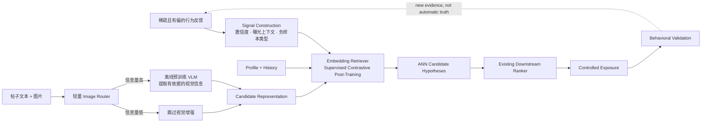
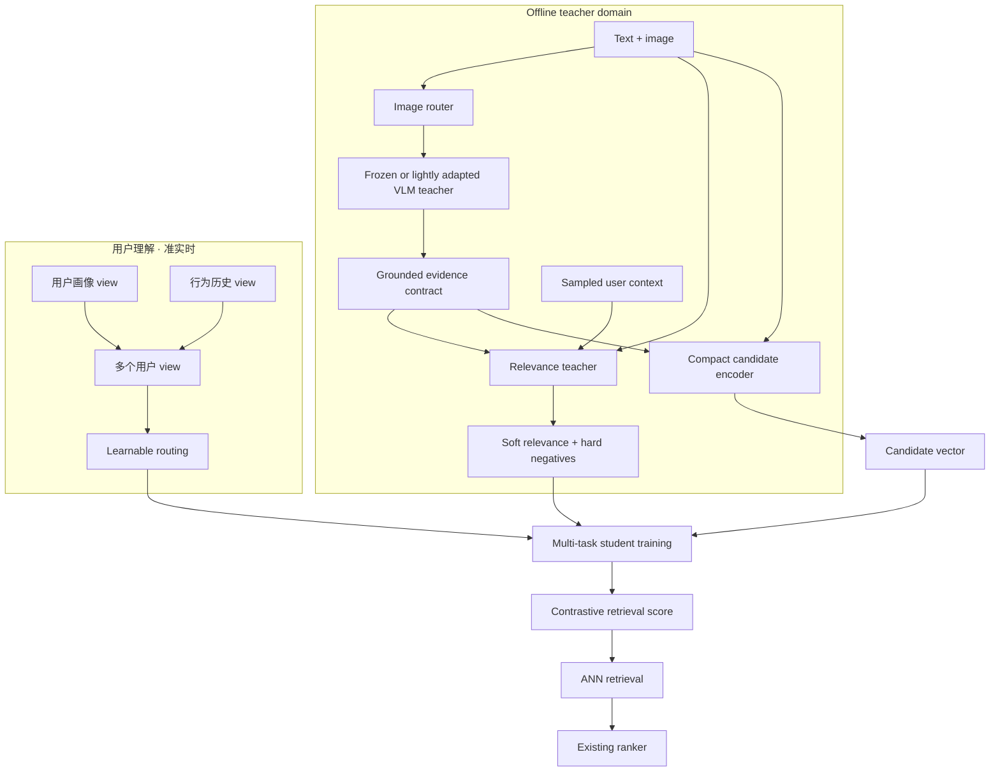
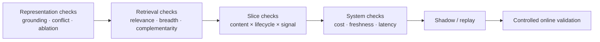

# 从噪声反馈到可服务的现代检索系统

**中文** · [English](noise-to-signal-retrieval.en.md)

> 这是一份公开且刻意抽象化的设计笔记，只讨论通用问题与取舍，不对应任何公司的数据规模、字段、模型配置、内部术语或生产系统。脱敏边界见[板块说明](../README.md)。

## 先用一句话讲清楚

现代检索系统真正困难的地方，不只是换一个更大的模型，而是：

> **怎样从极少、受旧策略影响的正反馈中学习一个可扩展的 proposal function，在海量未观测内容里找到更可能产生正反馈的候选，同时不把“模型高分”误当成新的真实标签。**

## Problem Framing：从稀疏正样本到候选假设

对用户 $u$，设 $\mathcal{C}$ 是全部可检索内容，$\mathcal{E}_u\subset\mathcal{C}$ 是旧策略真正曝光过的内容，而 $\mathcal{P}_u\subset\mathcal{E}_u$ 是其中获得可靠正反馈的极小子集。系统面对的不是普通分类问题，因为 $\mathcal{C}\setminus\mathcal{E}_u$ 中绝大多数内容**没有标签，而不是负样本**。

召回模型学习一个打分函数 $f_\theta(u,c)$，再从未观测空间提出候选：

\[
\mathcal{H}_u
=\operatorname{TopK}_{c\in\mathcal{C}\setminus\mathcal{E}_u} f_\theta(u,c).
\]

$\mathcal{H}_u$ 是 **positive hypotheses**，不是新的 positives。它们只有经过下游精排、真实曝光和行为验证后，才可能形成新的训练信号。因此整套系统可以抽象为四个职责：

1. **Signal construction**：判断历史日志中哪些反馈足以成为监督；
2. **召回模型**：在巨大未观测空间中低成本提出高潜力候选；
3. **精排 / policy**：结合请求级上下文决定哪些候选真正获得曝光；
4. **Evaluation / experiment**：验证候选是否带来用户价值，并将新证据写回下一轮训练数据。

所以更准确的名字不是“自动寻找 positive labels”，而是 **候选 discovery from sparse, selectively observed feedback**。召回模型是 hypothesis generator；线上行为才是新的证据 generator。



## 0. 先做问题审计：信号窄，尺子也窄

在改模型之前，先把问题分成四类。下面不是某个系统的字段或统计，而是大规模行为检索里反复出现的通用故障模式。

| 层面 | 常见症状 | 为什么致命 |
| --- | --- | --- |
| 训练标签 | 名义上有多种行为，实际被一种容易收集的 proxy 主导；明确拒绝没有进入监督 | 模型只学会复制最常见的行为信号，而不是更完整的相关性 |
| 用户证据 | 历史只保留正向互动；历史薄或容易被截断的用户在训练中代表不足 | 模型不知道用户排斥什么，也最不了解真正需要 durable intent 兜底的人 |
| Negative / loss | 大量 negative 来自未曝光候选或其他用户的 positive；实际竞争池可能比设计目标小 | “没见过”被误写成“不喜欢”，而模型练习的选择题又可能远比目录级检索简单 |
| 离线评估 | positive 很薄，Recall 依赖候选池和分母定义；train/eval 共享同一种行为 proxy | 分群绝对值不可直接比较，新信号即使有价值，也可能在旧尺子上量不出来 |

可以把它压缩成一句话：**训练侧的信号太窄，评估侧的尺子也太窄。** 因此 signal、model 和 evaluation 必须一起设计；只换其中一层，很容易得到一个无法解释的离线数字。

## 1. 先把 Noise 变成 Signal

日志中的点击、停留和跳过不是天然的偏好标签。用户只会对旧系统展示过的内容产生反馈；没有互动，也可能只是没有看到。

训练样本至少要区分：

- **可靠正样本**：有较强行为证据支持；
- **曝光负样本**：确实获得展示机会，但出现明确负向行为；
- **困难负样本**：语义接近或模型高分，但与当前用户上下文不匹配；
- **未观测候选**：没有足够证据判断相关或不相关，不能全部标成负样本。

这一步比先争论 SFT、DPO 还是 RL 更重要。训练算法只能放大收到的监督；如果标签语义不清楚，更复杂的后训练只会更稳定地学习错误目标。

## 2. 选择性理解图片，而不是全量运行大模型

Text-only 向量会漏掉截图、图表、海报和普通照片里的关键信息，但对所有图片运行大 VLM 又会浪费计算。

先用轻量路由器判断处理需求：

```text
image
→ natural photo / screenshot / slide-like / chart / poster / decorative
→ 根据类型和置信度分配计算
```

路由器不需要完整理解图片，只需要回答：**这张图是否包含额外信息，以及应该走哪条处理路径？**

对于高信息量图片，再使用预训练 VLM 提取：

- 可见文字与关键实体；
- 图片、截图或图表表达的主要内容；
- 原文没有明确写出的视觉证据；
- 图文是否一致，以及判断置信度。

第一版通常不需要微调 VLM。先用固定 schema 做结构化抽取；只有出现稳定、可复现且影响下游检索的领域错误时，才考虑 LoRA 或 SFT。

## 3. Post-Training：Teacher 究竟产出什么

VLM 不是在线检索模型，而是一个离线、可替换的教师模型。它有两个不同职责，不能混成一个模糊的“多模态增强”：

1. **内容证据**：在内容创建或更新时读取图片，输出带来源和置信度的结构化事实；
2. **训练监督**：在抽样的用户–候选 pair 上结合用户上下文与图文内容，给出软相关性、pairwise preference，并挖出“看起来相似但不适合当前用户”的 hard negatives。

第一项改善候选表示；第二项才真正拓宽 dwell-like proxy 之外的监督。只做 feature extraction，无法自动修复窄标签问题。

内容证据可以使用固定 schema：

```json
{
  "visual_type": "photo | screenshot | chart | poster | decorative",
  "visual_evidence": ["visible entities", "readable text", "visual claim"],
  "text_image_relation": "support | complement | conflict | irrelevant",
  "confidence": "calibrated score",
  "provenance": "which region supports each claim"
}
```

原文与这份证据交给轻量内容编码器，生成可提前计算并写入 ANN index 的向量。软标签和 hard negatives 只在训练阶段消费。这样，教师模型同时增强内容理解和监督密度，却不会进入每次在线请求。

### 模块怎样连接



### 模型选择：按角色定能力，不按榜单最大值

这里的模型选择不是“找 benchmark 最大的模型”，而是为每个模块选择刚好足够的能力：

| 模块 | 起始选择 | 选择标准 | 为什么不直接用更大的模型 |
| --- | --- | --- | --- |
| Image 路由器 | 小型视觉分类器或通用视觉编码器 | 内容类型、信息量与置信度校准 | 路由器只决定是否调用教师模型，不负责完整理解 |
| Visual / relevance teacher | 能稳定遵循 schema 的中小型开源 VLM | grounding、图文冲突、pairwise relevance、hard-negative precision 与校准 | 教师离线选择性调用；更大模型只有通过同一 held-out set 才值得增加成本 |
| Candidate/用户塔 | 紧凑的开源 embedding model | 检索质量、吞吐、长文本、向量大小与刷新成本 | first-stage retrieval 需要频繁编码和大规模 ANN，容量必须服从 serving 预算 |
| 下游精排 | 复用已有精排 | 请求级 relevance、quality、新鲜度 | First-stage 召回模型不需要重复承担精排职责 |

通用 benchmark 只能说明模型适合作为初始化，不能证明它适合某个反馈分布。Embedding model 的选择看 retrieval、breadth、complementarity、latency、index size 和 freshness；教师模型的选择看独立 held-out set 上的 grounding、相关性校准和 hard-negative precision。

直接用 multimodal encoder 生成候选向量也是一个实验臂，但它把视觉理解、向量空间和索引刷新绑定在同一个 checkpoint。默认的 **VLM teacher → grounded evidence / supervision → compact embedding student** 更容易审计、缓存、降级和独立升级，也允许纯文本内容复用同一个 ANN index。

### 参数怎样共享

这是一个**非对称 dual-encoder**：用户与候选最终位于同一个向量空间，但输入分布和更新频率不同。

```text
Candidate tower: post text + grounded visual evidence → z_c
用户 views:    instructed profile / history / latent intent → z_u,r
Similarity:      cosine(z_u,r, z_c), after identical pooling + L2 normalization
```

一个实用起点是：所有塔从同一个通用 embedding checkpoint 初始化，候选与用户两侧使用独立参数或 adapter；profile/history 在用户侧共享主干，再使用不同 instruction、adapter 或 projection head。这样既保留共同语义空间，也允许不同输入学习不同的压缩方式。

必须固定 train/serve parity：同一 tokenizer、instruction template、last-token pooling、L2 normalization、截断规则和视觉证据 schema。否则离线训练的相似度不再等于线上 ANN 使用的相似度。

最容易被忽略的一处 parity 破坏不在这个列表里：**候选索引相对编码器是会过期的**。重训内容塔之后，索引里每一个向量都要重新编码，而在灰度期间索引是新旧向量混合的——此时向量空间不一致，相似度不可比。索引重建策略和证据 table 的版本号，必须和模型版本绑在同一个清单里。

用户侧不必把所有信息平均成一个点。Profile 与 history 可以保留为不同视图，也可以继续展开成多个潜在意图向量。路由器根据上下文决定各视图的权重；它的价值不在于“塔更多”，而在于不同视图是否提供**互补的相关候选**：

- profile 提供稳定但通常更弱的长期证据；
- history 提供更强但可能更窄的近期证据；
- 潜在视图防止少数兴趣被一个平均向量稀释；
- routing 只有在不同视图带来 unique relevant 候选时才值得增加复杂度。

Serving 时不能先把这些向量平均掉，否则又回到了单点表示。更直接的做法是在一个固定总预算 $B$ 下分配每个视图的查询额度：

\[
K_r = \operatorname{round}\!\left(B\cdot \operatorname{softmax}(g(u))_r\right),
\qquad
\mathcal{C}(u)=\bigcup_r \operatorname{ANN}(\mathbf{z}_{u,r},K_r).
\]

各视图分别查询同一个候选索引，随后合并去重，并把来源视图、相似度和路由器 weight 交给下游精排。这样多意图增加的是候选互补性，而不是无界增加在线候选量。

### 训练分成三层

**第一层：构造监督。** 从可靠正样本、曝光负样本、语义困难负样本和未观测候选中构造带置信度的训练批次，避免把“没看见”误当成“不喜欢”。

**第二层：多任务后训练。** InfoNCE 保留 retrieval 主目标；教师软相关性使用 KL 或 pairwise distillation；不同行为保留独立辅助头；teacher-mined hard negatives 进入对比池。各项权重必须 sweep，并监控任务梯度是否互相抵消。

**第三层：防止模块坍缩。** 单独约束路由器和模态使用：

- 对视觉信息冗余的样本，完整输入和 text-only 输入应保持相近；
- 对视觉信息关键的样本，遮掉图片后分数应该发生可解释的变化；
- 对图文冲突样本，模型应降低置信度或保留冲突标记，而不是静默地把两者拼在一起；
- 对多视图用户 representation，监控路由熵、视图使用率与 unique-target contribution，避免所有样本都退化到同一个塔。

一个抽象目标可以写成：

\[
\mathcal{L}
=\mathcal{L}_{\text{InfoNCE}}
+\lambda_d\mathcal{L}_{\text{distill}}
+\sum_a\lambda_a\mathcal{L}_{\text{action},a}
+\lambda_{r}\mathcal{L}_{\text{routing}}
+\lambda_{m}\mathcal{L}_{\text{modality}}
+\lambda_{c}\mathcal{L}_{\text{calibration}}.
\]

这里的核心仍是 **supervised contrastive 微调**，而不是直接对固定候选检索使用生成式 GRPO。只有当任务变成跨多轮、需要优化长期 slate reward 或 exploration policy 时，RL 才解决了一个不同且合理的问题。

### 先做便宜版：它是大架构的 go/no-go gate

在投入教师模型、蒸馏和路由器之前，先在固定的独立评估集上做两件低成本改动：把可信的 skip / rejection 加入 negative 语义，并把不同行为从一个 OR label 拆成独立目标。如果更丰富的监督仍然没有带来稳定、可解释的变化，就不应该默认更昂贵的教师模型会解决问题。

这个顺序强迫系统先修好评估，也把“是否值得增加复杂度”变成可证伪问题，而不是架构偏好。

### 一次完整的训练与发布怎样运行

1. **冻结时间点**：按事件时间生成用户快照、content snapshot 和 exposure context，防止使用未来信息；
2. **生成视觉证据**：路由器决定哪些图片调用教师模型，结果写入带版本号的证据 table；
3. **编译训练样本**：将行为标签、负样本类型、用户视图、原文和视觉证据绑定到同一清单；
4. **训练召回模型**：先冻结教师模型，只更新用户塔、内容编码器与路由器，分别记录每项 loss 和各视图使用率；
5. **导出与回放**：批量生成候选向量，建立隔离的 ANN index，在固定精排上执行离线 replay 和 ablation matrix；
6. **逐级发布**：通过 representation、retrieval、切片和 systems gates 后，再进入 shadow traffic 与受控线上验证。

如果某张图片解析失败，流水线必须回退到原文表示；如果某个用户视图缺失，路由器必须对剩余视图重新归一化。**Fallback 是训练和 Serving contract 的一部分，而不是上线后的补丁。**

召回模型负责扩大高质量候选空间；已有下游精排继续负责请求级别的精细 relevance、quality、新鲜度与最终排序。

## 4. 把复杂计算留在 Offline

```text
Offline:  image routing → selective VLM → candidate embedding → ANN index
准实时: profile/history update → cached 用户 representation
Online:   cache lookup → ANN retrieval → existing ranker → final slate
```

这样，多模态能力增加的是候选理解，而不是每次请求的生成式推理成本。视觉处理失败时应逐级回退到可见文字，最终回退到纯文本向量，不能阻止新内容进入索引。

## 5. Evaluation：怎样证明每个模块真的有用

> 本节描述的是实验协议和发布门槛，不包含任何观察到的结果。

聚合分数可能掩盖用户群体退化，也可能把“结果更相关、但语义越来越窄”误写成全面提升。评估因此要回答五个独立问题。

### 5.0 Signal 和尺子必须一起换

如果 student 学习教师生成的相关性，再用同一个教师评价 student，就形成了自证循环。至少保留三种互相独立的锚点：

- 稀疏但语义明确的显式行为；
- 教师没有参与生成或筛选的时间切片与用户切片；
- 一个小而稳定的人工相关性 / pairwise preference 集合。

旧指标仍然保留，用来检查兼容性；新指标负责衡量旧 proxy 看不见的信号。只有两套尺子共同报告，才能区分“真实增加了信息”和“只是换了一种自洽的打分方式”。

### 5.1 模型真的使用了视觉信息吗

只比较 text-only 和 multimodal 两个总分不够，因为模型可能只是利用文本先验。需要构造配对的 counterfactual tests：

| 输入条件 | 目的 | 应观察什么 |
| --- | --- | --- |
| 完整图文 | 正常路径 | 基准排序与置信度 |
| 遮掉图片 | modality ablation | 视觉关键样本的排序是否有针对性地变化 |
| 遮掉文字 | image-only probe | 图片能否独立提供最低限度的语义证据 |
| 随机交换图片 | prior control | 无关图片是否会错误影响排序 |
| 保留图片但删除 VLM 证据 | module ablation | 收益究竟来自路由器、教师模型还是编码器 |

最关键的集合不是随机样本，而是 **visual-essential subset**：文本本身不足以区分候选，而图片包含任务所需信息。只有在这里发生方向正确、可归因的变化，才能说明模型真的使用了视觉信号。

### 5.2 图文冲突时会发生什么

构造语义匹配但事实冲突的 pair，例如正文描述一个对象，而图片展示另一个对象；同时加入无冲突的 matched controls。评估三个层面：

1. 教师模型是否输出 `conflict`，并指出冲突来自哪里；
2. 内容编码器是否避免把矛盾证据压成一个过度自信的向量；
3. 最终 retrieval/ranking 是否降低不可靠候选的置信度，而不是仅仅提高一个中间 conflict-classification 分数。

### 5.3 新模态是否改善最终任务

所有实验固定候选池规模、ANN 预算、下游精排和评估样本，只替换被测模块。建议按下面的阶梯逐层比较：

```text
T0  text-only candidate representation
T1  + image router
T2  + selective VLM evidence
T3  + modality-aware post-training
T4  + multi-view 用户 routing
```

每一级都同时记录：

- **最终任务**：Recall、NDCG、有效候选命中与下游精排可选择的 relevant set；
- **breadth**：topic coverage、within-list similarity、长尾候选覆盖；
- **complementarity**：新增模块贡献的 unique relevant 候选；
- **中间诊断**：路由器 accuracy、grounding、conflict detection，只用于解释最终任务变化；
- **systems**：VLM 调用率、单内容处理成本、索引新鲜度、缓存命中与在线 latency。

中间指标变好但最终候选质量不变，不足以支持上线；最终任务改善但新鲜度或成本越界，同样不能通过。

### 5.4 不同内容和用户是否都受益

同一个实验需要在预先定义的切片上重复，而不是在看到结果后挑群体：

- **内容**：text-rich、visual-essential、screenshot/chart、natural image、长尾主题与语言；
- **用户**：lifecycle、历史长度、反馈强度、兴趣集中度与冷启动程度；
- **交叉切片**：例如 sparse-history × visual-essential，检查新增模态是否只帮助数据本来就丰富的群体。

报告每个切片的 relevance、breadth、coverage、calibration 与失败率，并附样本量和置信区间。这里的“公平受益”不是要求所有群体获得完全相同的数值，而是确保总体平均值不会遮住稳定、可解释的 subgroup harm。

### 5.5 一套可执行的发布门槛



每次实验都应绑定同一份清单：数据快照、标签定义、教师模型与编码器版本、负样本 sampler、ANN index、精排版本、切片定义和随机种子。这样观察到的变化才能归因到具体模块，而不是数据或评估配方漂移。

User simulation 可以用于 repeated exposure、topic fatigue 和 exploration 的压力测试，但它不能替代真实用户。它更适合作为 online test 之前的 failure discovery layer，而不是产生最终性能结论。

## 这套设计真正优化什么

```text
更可靠的训练信号
→ 更完整的用户与内容表征
→ 更多互补的相关候选
→ downstream ranker 拥有更好的选择空间
→ 用多维评估和线上实验验证真实价值
```

目标不是堆叠热门模块，而是让每一层都为最终决策增加新的、可验证的信息。
