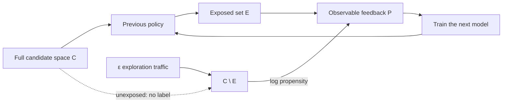

# Offline went up, online didn't

[中文](offline-online-skew.md) · **English**

> Reading time: ~5 min · Type: practice note · Last reviewed: 2026-08

## In one sentence

When offline metrics and online results disagree, the usual cause is not overfitting. It is that **your training set, your evaluation set and the distribution you actually serve are three different distributions.** The first two share a policy-contaminated source, so they agree with each other while both being wrong.

## How the bias gets in

For user $u$, let $\mathcal{C}$ be all content, $\mathcal{E}_u \subset \mathcal{C}$ what the previous policy **exposed**, and $\mathcal{P}_u \subset \mathcal{E}_u$ the part that earned positive feedback.

Labels exist only inside $\mathcal{E}_u$. Everything in $\mathcal{C} \setminus \mathcal{E}_u$ is unlabelled — **not negative, unseen**.

That alone is survivable. What isn't, is that it closes into a loop:

$$\mathcal{E}_u^{(t+1)} = \text{expose}\big(f_{\theta^{(t)}}\big), \qquad \theta^{(t+1)} = \text{train}\big(\mathcal{P}_u \subset \mathcal{E}_u^{(t+1)}\big)$$

The model can only learn from what it already proposed. Anything it never proposed never earns evidence, so it never gets proposed — not because it is irrelevant, but because it was never seen.

After a few rounds "more relevant" and "the model already preferred it" become indistinguishable. Meanwhile offline metrics climb, because **the evaluation set is drawn from the same exposure distribution**: you are grading the model on questions it chose.

The loop itself is not a bug. **The problem is having no edge back from the unobserved region.** Exploration adds that missing evidence channel.

This is why **no loss function fixes it**. Nothing in the objective knows what is in $\mathcal{C} \setminus \mathcal{E}_u$. Regularisers, temperatures and better losses all operate inside the observed slice.

## The only way out: exposure the model doesn't control

Reserve a small fraction $\varepsilon$ of exposures for candidates the model didn't choose — uniform, or stratified by content age or tail depth.

$\varepsilon$ doesn't need to be large. Its value isn't current-period return (that is always negative); it is being the **only** source that can answer "how do the items the model never proposed actually perform?"

Then log what happened. This step is irreversible:

| What to log | Why it can't wait |
| --- | --- |
| Propensity $p(c \mid u)$ — probability this exposure happened | **Cannot be reconstructed afterwards.** Without it, every debiasing method is unavailable |
| Which channel or model proposed it | Otherwise there is no attribution and no marginal-contribution measure |
| Whether the slot was random or model-chosen | Random slots are the only unbiased evaluation sample |

With $p$, an unbiased estimate becomes expressible:

$$\hat{R}_{\text{IPS}} = \frac{1}{N}\sum_{i} \frac{\mathbb{1}[\text{positive}_i]}{p(c_i \mid u_i)}$$

The intuition: an item the old policy showed with probability 1% that got positive feedback should count for 100× — it stands in for the 99 comparable opportunities you never observed.

> In practice $1/p$ has brutal variance as $p \to 0$; capped IPS or doubly robust estimators are the usual answer. But those are choices you make **given** $p$. Without logging it, none of them are on the table.

## Three distributions, kept separate

| Distribution | Source | Used for | Trap |
| --- | --- | --- | --- |
| Training | $\mathcal{P}_u \subset \mathcal{E}_u$ | fitting | inherits the old policy's blind spots |
| Offline eval | same | fast iteration | **same source as training**, so it cannot validate the blind spots |
| Live | $\mathcal{C}$ | what you actually serve | only random slots sample it |

The shape of the problem is in the first two rows sharing a source. Offline numbers reliably answer "on things the old policy already showed, is the new model better?" — and are **structurally unable** to answer "what about things it never showed?", which is the entire reason for changing the retriever.

## The checklist

Before shipping, four questions:

1. **What fraction of my evaluation set comes from random exposure slots?** If zero, my offline numbers hold only on the old policy's support.
2. **Is propensity being logged at exposure time?** If not, start today — it cannot be backfilled.
3. **How much do the new model's candidates overlap the old policy's?** High overlap means it didn't widen anything; low overlap means offline evaluation barely covers it and online weighs more.
4. **Is my reported gain concentrated on frequently-exposed content?** Bucket by exposure frequency. Head improves, tail flat usually means the model learned the old policy's preferences rather than the users'.

## Where to read next

- [What counts as a positive, and as a negative](positive-negative-design.en.md) — the same problem at the label layer
- [From noisy feedback to a servable retrieval system](noise-to-signal-retrieval.en.md) — the whole chain
- [Evaluation](../../07-evaluation/README.en.md)
