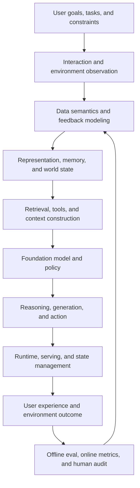

# Modern AI Systems: An End-to-End Map

[中文](README.md) · **English**

## Core view

Many apparent model failures originate outside the model: training data does not represent the task, retrieval supplies the wrong evidence, tool state violates model assumptions, offline evaluation measures the wrong objective, or deployed feedback is contaminated by the product policy.

I therefore view an AI system as a continuous **sense–model–search–act–measure–learn loop**.



## Eight layers

### 1. Objective and task contract

Define the real outcome, target population, failure cost, and non-negotiable constraints. Without this layer, downstream metrics optimize an ambiguous proxy.

### 2. Data and feedback-generating process

Data is produced by previous models, exposure policies, interfaces, user choices, and logging rules. Training requires understanding who was observed, who was omitted, and why feedback occurred.

### 3. Representation, memory, and state

The system decides what enters short-term context, what becomes persistent state, and what should be forgotten or revised. User intent is often a distribution rather than one static point.

### 4. Search, retrieval, and tools

Search determines what the model can see. It includes query formulation, candidate generation, evidence deduplication, exploration, tool choice, and context-budget allocation—not only similarity ranking.

### 5. Model and post-training

Pretraining creates a capability prior; continued pretraining shifts domain knowledge; SFT shapes imitable behavior; preference learning and RL adjust policy. The feedback must be dense, stable, and attributable enough for the selected method.

### 6. Runtime and serving

Runtime may not be the research thesis, but it determines whether the thesis can exist. Latency, batching, caching, tool failures, state synchronization, and cost all affect observed policy behavior.

### 7. Evaluation and observability

Evaluation is not a final score. It continuously tests the system contract through regression checks, structural invariants, semantic quality, subgroup behavior, online outcomes, and long-term effects.

### 8. Product feedback loop

Deployed behavior becomes future data, but it is conditioned on the current policy. The system must distinguish what users prefer from what the system happened to expose.

## A more reliable evaluation stack

| Layer | Best for | Strength | Risk |
| --- | --- | --- | --- |
| Deterministic rules | Schema, format, state, tools, structure | Fast, stable, regression-friendly | Cannot judge open-ended semantic quality |
| Reference / executor | Math, code, evidence, task completion | Close to verifiable truth | References may be incomplete or wrong |
| LLM judge | Relevance, helpfulness, style, open-ended quality | Scalable semantic judgment | Bias, drift, and nondeterminism |
| Pairwise judge | Relative model, prompt, or policy comparison | More natural than absolute scoring | Position bias; may hide that both are bad |
| Human audit | Rubrics, edge cases, value judgments | Understands real context | Expensive and internally inconsistent |
| Online and longitudinal metrics | Real outcomes and sustained experience | Closest to the product objective | Confounding, delay, and experiment cost |

### When using an LLM judge

- Specify the criterion before selecting single-output or pairwise evaluation.
- Do not delegate deterministic conditions to a probabilistic model.
- Decompose complex rubrics into atomic judgments; a DAG organizes decisions but does not guarantee validity.
- Swap pairwise order and allow ties or “both bad.”
- Calibrate with references, few-shot examples, and human-labeled cases.
- Track agreement with humans and failures across meaningful slices.
- Record the prompt, model version, temperature, and evidence for reproducibility.

## A reusable problem frame

```text
Goal       What outcome should improve?
System     What are the data, components, control flow, and consumers?
Invariant  What property must remain true?
Failure    How does it fail, and in which slices?
Hypothesis What is the cause, and what would falsify it?
Constraint What hardware, latency, budget, compatibility, and data limits apply?
Change     Which variable will change?
Evidence   How do offline, online, quantitative, and qualitative evidence combine?
Tradeoff   What improves, and what may become worse?
```

The point is not to master every layer. It is to preserve the complete context while working deeply on one part.
