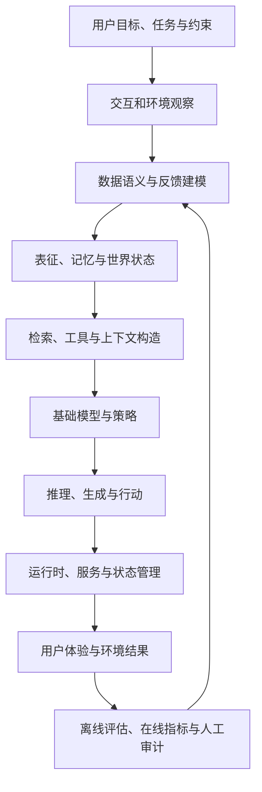
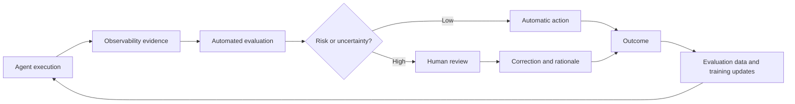

# 现代 AI 系统：一张端到端地图

**中文** · [English](README.en.md)

## 核心判断

今天很多所谓的“模型问题”，实际发生在模型以外：训练数据没有覆盖真实任务，检索没有提供正确证据，工具状态与模型假设不一致，离线评估测量了错误目标，或者上线后的反馈被产品策略污染。

因此我更愿意把 AI 系统理解为一个不断循环的**感知—建模—搜索—行动—测量—学习系统**。



## 八个层次

### 1. 目标与任务合同

先定义系统真正需要改善的结果、适用人群、失败成本与不可违反的约束。没有这一层，后面的指标只能优化一个模糊 proxy。

### 2. 数据与反馈生成过程

数据不是自然出现的。它由旧模型、曝光策略、界面、用户选择和日志规则共同生成。训练前需要理解谁被观察、谁被遗漏，以及反馈为何发生。

### 3. 表征、记忆与状态

系统需要决定哪些信息进入短期上下文，哪些成为长期状态，哪些应该遗忘或降低置信度。用户意图往往是分布而不是一个静态点。

### 4. Search、Retrieval 与工具

Search 决定模型能够看到什么。它不仅是相似度排序，还包括 query formulation、候选生成、证据去重、探索、工具选择和上下文预算分配。

### 5. 模型与后训练

Pretraining 提供能力先验；continued pretraining 调整领域分布；SFT 塑造可模仿行为；preference learning 与 RL 调整策略。选择方法之前，必须先判断反馈是否足够密集、稳定且可归因。

### 6. Runtime 与 Serving

运行时不是研究的主线，但它决定研究结论能否真实存在。延迟、批处理、缓存、工具失败、状态同步和成本都会改变最终策略表现。

### 7. Evaluation 与 Observability

评估不是最后生成一个分数，而是持续验证系统合同：离线回归、结构 invariant、语义质量、子群体行为、线上结果和长期影响。

### 8. 产品反馈闭环

上线后的反馈会成为下一轮数据，但它已经受到当前策略影响。系统需要区分“用户喜欢”与“系统只给用户看到了这个”。

## 一套更可靠的评估栈

| 层级 | 适合测量 | 主要优势 | 主要风险 |
| --- | --- | --- | --- |
| 确定性规则 | schema、格式、状态、工具、结构 | 快、稳定、可回归 | 无法判断开放式语义质量 |
| Reference / Executor | 数学、代码、事实证据、任务完成 | 接近可验证真值 | 参考可能不完整或本身错误 |
| LLM Judge | 相关性、帮助性、风格、开放式质量 | 可扩展、能处理语义 | 偏差、漂移、非确定性 |
| Pairwise Judge | 模型、prompt、策略的相对比较 | 通常比绝对打分更自然 | 位置偏差，无法表达两者都差 |
| 人工审计 | rubric、边界案例、价值判断 | 能理解真实上下文 | 成本高且标注者也不一致 |
| 在线与纵向指标 | 真实使用结果与长期体验 | 最接近产品目标 | 有混杂、反馈延迟和实验成本 |

### 使用 LLM Judge 时

- 先写清 criterion，再决定 single-output 还是 pairwise。
- 能确定性判断的条件，不交给概率模型。
- 把复杂 rubric 分解成原子判断；DAG 是一种组织方法，而不是可靠性的自动保证。
- 对 pairwise 交换候选顺序，并允许 tie / both bad。
- 使用 reference、few-shot 和人工样本校准。
- 持续测量 judge 与人的一致性，以及它在哪些 slice 上失效。
- 保存 prompt、model version、temperature 和输入证据，使结果可复现。

## 我会怎样分析一个新问题

```text
Goal       真正想改善什么？
System     数据、组件、控制流与消费者是谁？
Invariant  什么性质必须保持？
Failure    现在具体怎样失败，在哪些 slice 上失败？
Hypothesis 原因是什么，什么证据会推翻它？
Constraint 硬件、延迟、预算、兼容性与数据限制是什么？
Change     只改变哪个变量？
Evidence   离线、线上、定量与定性证据如何组合？
Tradeoff   改善了什么，又可能伤害什么？
```

这张地图的作用不是要求一个人精通每一层，而是避免在局部优化时失去完整上下文。

## 两个关键专题

- [AI Agent Observability](agent-observability.md)：把一次 Agent 运行还原成可查询、可比较、可重放的决策轨迹。
- [Human-in-the-Loop](human-in-the-loop.md)：根据风险、不确定性和新颖性决定何时由人审查、批准或纠正。

它们共同形成一条改进链路：


