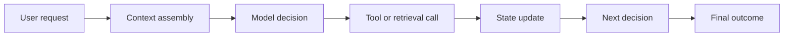

# AI Agent Observability

**中文** · [English](agent-observability.en.md)

## 核心判断

传统软件 observability 主要回答“服务是否正常”，Agent observability 还必须回答：

> **Agent 看到了什么、相信了什么、为什么选择这个行动，以及失败从哪一步开始传播？**

只记录最终回答或错误码是不够的。Agent 的失败可能来自错误检索、过期记忆、工具返回异常、状态转换错误、循环执行、评价标准不一致，或者模型在正确证据上做出了错误判断。

## 一次运行需要记录什么

### 1. Identity 与版本

- model、prompt、tool、retriever、memory policy 和 evaluator 的版本
- 数据、index、feature 与配置版本
- session、user、task、trace 和 experiment 标识

### 2. Context 与证据

- 进入模型的指令、记忆、检索结果和工具返回
- 哪些候选被过滤、截断或重新排序
- token、时间和成本预算怎样分配

### 3. 决策与状态转换

- 每一步选择了什么 action
- action 的输入、输出、异常和重试
- 状态在执行前后怎样变化
- cancellation、timeout、fallback 与人工接管是否发生

### 4. 结果与评价

- 任务是否完成，而不只是是否生成文本
- 确定性 invariant、reference check 与 LLM judge 结果
- 用户纠正、后续行为和长期 outcome

## Trace 不是日志堆积

好的 trace 应该围绕因果链组织，而不是简单保存大量字符串。常见 span 可以包括：

- `model`：输入上下文、输出、延迟、token 与模型版本
- `retrieval`：query、候选、score、过滤和最终 context
- `tool`：参数、返回、异常、重试与副作用
- `memory`：读取、写入、压缩、遗忘与置信度变化
- `policy`：路由、停止、fallback 与风险决策
- `evaluation`：rubric、证据、verdict 与 evaluator 版本
- `human_review`：升级原因、人工决定、修改和 rationale

## 从监控到理解

| 层次 | 回答的问题 |
| --- | --- |
| Metrics | 系统整体发生了什么变化？ |
| Logs | 某个组件报告了什么事件？ |
| Traces | 一次请求经过了哪些决策与依赖？ |
| Replay | 相同证据和版本能否复现失败？ |
| Evaluation | 这条轨迹是否满足任务合同？ |
| Slicing | 失败集中在哪类用户、任务、工具或环境？ |

## 重要 failure modes

- **Loop**：重复调用工具或反复推理，但状态没有实质变化。
- **Context drift**：后续行动依据的目标或证据已偏离原始任务。
- **Memory contamination**：错误、过期或不属于当前用户的信息进入长期状态。
- **Tool mismatch**：模型假设的工具语义与真实 API 行为不同。
- **Silent fallback**：系统降级后仍返回看似正常但质量更差的结果。
- **Evaluator blind spot**：评估只看最终文本，没有检查过程与副作用。
- **Cost runaway**：额外 token、工具调用或重试没有带来相应进展。

## 我的理解

Observability 的最终产物不应该只是 dashboard，而应该是三类可行动证据：

1. 能稳定复现的 failure case；
2. 能进入离线评估集的行为轨迹；
3. 能驱动 prompt、policy、tool、memory 或 post-training 更新的明确归因。

如果 trace 不能帮助系统决定“下一步改什么”，它更多只是昂贵的日志保存。
