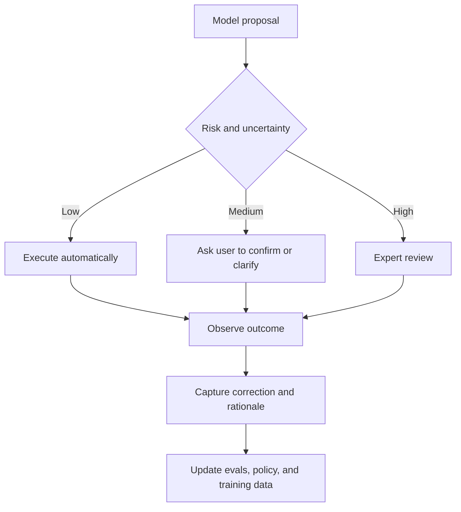

# Human-in-the-Loop

**中文** · [English](human-in-the-loop.en.md)

## 核心判断

Human-in-the-Loop（HITL）不是“模型不行时全部交给人”，而是一种**控制策略**：系统根据风险、不确定性、新颖性和可逆性，决定什么时候自动执行，什么时候请求确认，什么时候升级给专家。

## 人可以扮演不同角色

| 角色 | 作用 |
| --- | --- |
| Teacher | 提供示范、偏好、纠正与 rationale |
| Reviewer | 审查高风险输出或关键行动 |
| Approver | 在产生不可逆副作用前授权 |
| Collaborator | 与模型共同分解问题、补充上下文 |
| Auditor | 定期检查自动系统和 evaluator 的盲区 |
| User | 直接表达目标、控制边界并纠正个性化状态 |

## 什么时候应该升级给人

可以把 routing 看成一个决策问题，而不是固定阈值：

> **升级价值 ≈ 失败风险 × 影响大小 × 模型不确定性 × 不可逆性 − 人工成本**

常见触发信号包括：

- 模型或多个 evaluator 之间明显不一致
- 输入超出历史分布或出现新工具、新任务
- 检索证据冲突、缺失或可信度不足
- 行动会修改外部状态、花费资金或影响他人
- 用户目标不明确，继续执行的机会成本很高
- 系统进入循环、连续 fallback 或成本异常

## 不只是得到一个 label

一次人工介入应该尽可能保存：

- 为什么升级；
- 人看到了哪些证据；
- 人最终做了什么决定；
- 修改了模型输出的哪一部分；
- 使用了什么 rationale 或规则；
- 这个案例应进入哪类 eval、policy 或 training update。

只有最终标签而没有上下文，后续很难判断模型应该学习什么。

## 三种时间尺度

### 实时介入

在执行前确认、在执行中接管，适合高风险或不可逆行动。

### 异步审查

抽样检查完成的轨迹，寻找系统性失败、judge bias 和新 failure mode。

### 周期性治理

重新审查 rubric、升级阈值、权限边界、数据保留和用户控制机制。

## 常见误区

- **把人当 fallback API**：没有提供足够上下文，却要求快速判断。
- **只审查最终回答**：忽略检索、工具、副作用和状态更新。
- **只收集同意/不同意**：没有保存修改与原因。
- **静态升级规则**：模型、任务和风险变化后阈值不更新。
- **反馈直接进入训练**：没有处理标注者差异、策略偏置和数据泄漏。
- **自动化偏见**：人因为模型表达自信而过度接受建议。

## 我的理解

好的 HITL 系统不是让更多任务依赖人，而是让**最有价值的人类判断**出现在正确的位置，并把这些判断转化为系统可以持续复用的 eval、规则、数据与策略。
